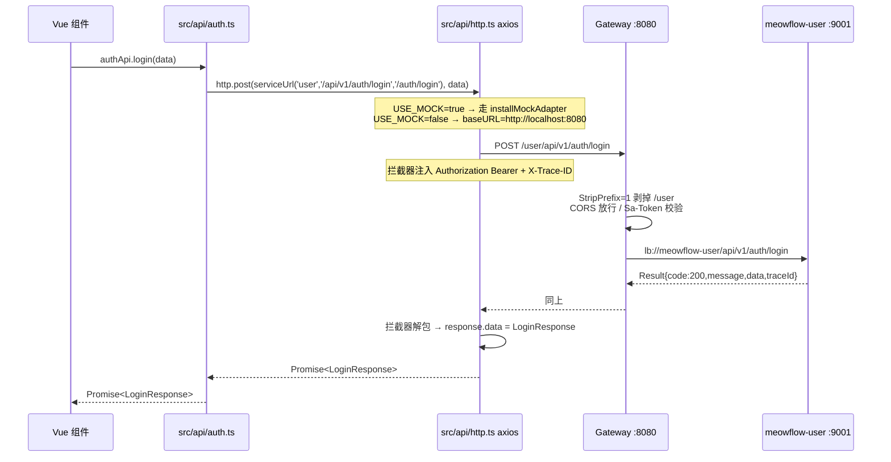

# 喵流 API 接口对接方案

> 前端与后端 API 联调契约
> 版本：v3.0 | 更新日期：2026-09-08

---

## 一、联调架构

### 1.1 组件角色

| 组件 | 角色 | 监听端口 |
|------|------|----------|
| 浏览器 | 运行 Vue 3 前端 | — |
| Vite Dev Server | 提供前端静态资源与 HMR | 5173 |
| meowflow-gateway | Spring Cloud Gateway，统一对外入口、CORS、Sa-Token 校验、Sentinel 流控 | 8080 |
| 各业务微服务 | user / workflow / executor / template / monitor / infra | 各自端口（Nacos 注册） |

### 1.2 一次请求的完整旅程



### 1.3 网关路由表

来源：`backend/meowflow/meowflow-gateway/src/main/resources/application.yml`

| 服务 | 网关入口前缀 | 转发目标 | StripPrefix |
|------|--------------|----------|-------------|
| user | `/user/**` | `lb://meowflow-user` | 1 |
| workflow | `/workflow/**` | `lb://meowflow-workflow` | 1 |
| executor | `/executor/**` | `lb://meowflow-executor` | 1 |
| template | `/template/**` | `lb://meowflow-template` | 1 |
| monitor | `/monitor/**` | `lb://meowflow-monitor` | 1 |
| infra | `/infra/**` | `lb://meowflow-infra` | 1 |

**调用路径拼接规则**：浏览器看到的是 `/{服务前缀}/api/v1/...`；网关剥掉 `{服务前缀}` 后转发给对应微服务的 controller。

---

## 二、后端契约

### 2.1 统一响应信封

来源：`backend/meowflow/meowflow-common/src/main/java/com/meowflow/common/result/Result.java`

```json
{
  "code": 200,
  "message": "操作成功",
  "data": { ... },
  "timestamp": 1757356800000,
  "traceId": "abc123"
}
```

- `code` 业务成功码：**200**（`ResultCode.SUCCESS`）
- `data` 为 `null` 时字段会被 `@JsonInclude(NON_NULL)` 省略
- `traceId` 由 `TraceContextHolder` 提供，前端 `X-Trace-ID` 与之对应

### 2.2 错误码

来源：`backend/meowflow/meowflow-common/src/main/java/com/meowflow/common/result/ResultCode.java`

| 范围 | 含义 |
|------|------|
| 200 | 成功 |
| 400 / 401 / 403 / 404 / 405 | HTTP 业务语义 |
| 500 / 503 | 服务器异常 / 服务不可用 |
| 1000-1999 | 业务通用（BIZ_ERROR、NODE_EXECUTE_ERROR、WORKFLOW_NOT_FOUND 等） |
| 2001-2003 | Sentinel（RATE_LIMITED、CIRCUIT_BREAKER_OPEN、REQUEST_REPEAT） |
| 3001-3007 | 鉴权（USERNAME_EXISTS、USER_NOT_FOUND、PASSWORD_ERROR、TOKEN_INVALID、TOKEN_EXPIRED、ACCOUNT_LOCKED、NOT_LOGGED_IN） |
| 4001-4002 | 数据（DATA_NOT_FOUND、DATA_ALREADY_EXISTS） |

完整错误处理：见 `GlobalExceptionHandler.java`（含参数校验、限流、熔断、业务异常的统一封装）。

### 2.3 Controller 写法

来源：`meowflow-user/.../AuthController.java`

```java
@Tag(name = "认证管理")
@RestController
@RequestMapping("/api/v1/auth")
@RequiredArgsConstructor
public class AuthController {

    @PostMapping("/login")
    public Result<LoginResponse> login(@Valid @RequestBody LoginRequest request) {
        return Result.success(authService.login(request));
    }
}
```

所有 controller 都基于 `Result<T>` 返回，由 `GlobalExceptionHandler` 把异常也包装成 `Result<Void>`。

### 2.4 鉴权

- 框架：Sa-Token
- Token 类型：JWT（Bearer）
- Header：`Authorization: Bearer <accessToken>`
- 双 token：`accessToken` + `refreshToken`，过期由 `http.ts` 自动刷新
- 关键配置（`meowflow-gateway/application.yml`）：
  ```yaml
  sa-token:
    token-name: Authorization
    timeout: 86400       # 1 天
    is-concurrent: true
  ```

### 2.5 接口清单（按微服务）

> 前端开发时浏览器实际看到的完整路径 = `网关前缀 + controller @RequestMapping + 方法 @XxxMapping`。
> 表中"后端路径"列是 controller 上的完整路径（即浏览器看到路径去掉网关前缀后的部分）。

#### user 服务

| 方法 | 后端路径 | 说明 |
|------|----------|------|
| POST | `/api/v1/auth/login` | 用户登录 |
| POST | `/api/v1/auth/refresh?refreshToken=...` | 刷新 token |
| POST | `/api/v1/auth/logout` | 退出 |
| GET | `/api/v1/auth/me` | 当前用户 |
| POST | `/api/v1/auth/register` | 注册 |
| POST | `/api/v1/auth/email-code` | 发送邮箱验证码 |
| POST | `/api/v1/auth/password/reset` | 邮箱重置密码 |
| GET | `/api/v1/users` | 分页查询用户 |
| POST | `/api/v1/users` | 创建用户 |
| PUT | `/api/v1/users/{id}` | 更新用户 |
| PUT | `/api/v1/users/{id}/password` | 修改密码 |
| PUT | `/api/v1/users/{id}/status?status=...` | 修改状态 |
| DELETE | `/api/v1/users/{id}` | 删除用户 |

#### workflow 服务（部分核心接口）

来源：`WorkflowController`、`ExecutionController`、`StatsController`

| 方法 | 后端路径 | 说明 |
|------|----------|------|
| POST | `/api/workflow` | 创建 |
| PUT | `/api/workflow/{id}` | 更新 |
| DELETE | `/api/workflow/{id}` | 删除 |
| GET | `/api/workflow/{id}` | 详情 |
| GET | `/api/workflow/page` | 分页（参数 `current/size`） |
| POST | `/api/workflow/{id}/versions` | 保存版本 |
| POST | `/api/workflow/{id}/versions/publish` | 发布版本 |
| GET | `/api/workflow/{id}/versions` | 版本列表 |
| POST | `/api/workflow/{id}/stop` | 停止 |
| POST | `/api/workflow/{id}/copy` | 复制 |
| POST | `/api/workflow/{id}/rollback/{version}` | 回滚 |
| POST | `/api/workflow/{id}/export` / `/{id}/export-with-history` | 导出 |
| POST | `/api/workflow/import` / `/{id}/import-version` | 导入 |
| POST | `/api/execution` | 触发执行 |
| POST | `/api/execution/{id}/cancel` | 取消 |
| GET | `/api/execution/{id}` | 执行详情 |
| GET | `/api/execution/page` | 执行分页 |
| GET | `/api/execution/{id}/nodes` | 节点执行列表 |
| GET | `/api/execution/{id}/logs` | 执行日志 |
| GET | `/api/execution/workflow/{workflowId}` | 工作流的所有执行 |
| POST | `/api/execution/{id}/debug/{breakpoints|resume|step|stop}` | 调试控制 |
| GET | `/api/execution/{id}/debug/{breakpoints|status|snapshots\|snapshots/{nodeId}}` | 调试查询 |
| GET | `/api/stats/overview` | 看板 |
| GET | `/api/stats/trend` | 执行趋势 |
| GET | `/api/stats/cost` | 成本统计 |

#### template 服务

| 方法 | 后端路径 | 说明 |
|------|----------|------|
| POST | `/api/template` | 创建 |
| PUT | `/api/template/{id}` | 更新 |
| DELETE | `/api/template/{id}` | 删除 |
| GET | `/api/template/{id}` | 详情 |
| GET | `/api/template/my` | 我的模板 |
| POST | `/api/template/{id}/use` | 使用模板 |
| POST | `/api/template/{id}/copy` | 复制 |
| POST | `/api/template/search` | 搜索 |
| GET | `/api/template/search/categories` | 分类 |
| GET | `/api/template/search/tags` | 标签 |

#### monitor 服务

| 方法 | 后端路径 | 说明 |
|------|----------|------|
| GET | `/api/monitor/metrics/latest` | 最新指标 |
| GET | `/api/monitor/alert/rule/page` | 告警规则分页 |
| POST | `/api/monitor/alert/rule` | 创建告警规则 |
| PUT | `/api/monitor/alert/rule/{id}` | 更新 |
| DELETE | `/api/monitor/alert/rule/{id}` | 删除 |
| GET | `/api/monitor/execution-log/page` | 执行日志查询 |

#### infra 服务

| 方法 | 后端路径 | 说明 |
|------|----------|------|
| POST | `/api/infra/chat/chat` | 非流式对话 |
| POST | `/api/infra/chat/stream` | SSE 流式对话 |
| GET | `/api/infra/chat/models` | 模型列表 |
| GET | `/api/infra/chat/health` | 健康检查 |
| CRUD | `/api/infra/knowledge/...` | 知识库 |
| CRUD | `/api/infra/mcp/...` | MCP 工具 |
| CRUD | `/api/infra/ai-model/...` | AI 模型配置 |
| CRUD | `/api/infra/integration/...` | 集成配置 |

---

## 三、前端封装

### 3.1 环境变量

`.env.development`：
```
VITE_USE_MOCK=true
VITE_GATEWAY_BASE_URL=http://localhost:8080
VITE_MOCK_DELAY=200
```

`.env.production`：
```
VITE_USE_MOCK=false
VITE_GATEWAY_BASE_URL=https://api.meowflow.com
```

### 3.2 Axios 实例与拦截器

来源：`frontend/meowflow-ui/src/api/http.ts`

```ts
const BASE_URL = import.meta.env.VITE_GATEWAY_BASE_URL || '';
const USE_MOCK = import.meta.env.VITE_USE_MOCK === 'true';

const http = axios.create({
  baseURL: BASE_URL,                  // 直连网关，不用 Vite proxy
  timeout: 30_000,
  headers: { 'Content-Type': 'application/json' },
});

// 请求拦截器：注入 Authorization + X-Trace-ID
http.interceptors.request.use((config) => {
  const token = getAccessToken();
  if (token) {
    (config.headers as any).Authorization = `Bearer ${token}`;
  }
  (config.headers as any)['X-Trace-ID'] =
    `trace-${Date.now().toString(36)}-${Math.random().toString(36).slice(2, 8)}`;
  return config;
});

// 响应拦截器：解 Result 信封；只放行 code === 200
http.interceptors.response.use((response) => {
  const envelope = response.data;
  if (
    envelope && typeof envelope === 'object' &&
    typeof envelope.code === 'number' && 'data' in envelope
  ) {
    if (envelope.code !== 200) {
      const err = new AxiosError(envelope.message || '请求失败', 'ERR_BAD_RESPONSE', ...);
      (err as any).response = response;
      return Promise.reject(err);
    }
    response.data = envelope.data;     // 业务数据从 envelope.data 取出
  }
  return response;
}, async (error) => { /* 401 自动刷新 + 业务码提示 */ });
```

要点：
- **baseURL 是绝对 URL**，因此浏览器直发到 8080 网关，**不经过 Vite proxy**（详见 §3.5）
- **业务成功码判定：仅 `code === 200`**，不兼容 `code === 0`
- 401 自动刷新使用订阅队列机制（多个并发 401 共享一次 refresh）
- Mock 模式启用时，`installMockAdapter(http)` 替换 axios adapter，请求被 `src/mock/index.ts` 接管

### 3.3 服务路径解析

来源：`frontend/meowflow-ui/src/api/endpoints.ts`

```ts
export const servicePrefix: Record<ApiService, string> = {
  user: '/user', workflow: '/workflow', template: '/template',
  monitor: '/monitor', infra: '/infra',
};

export function serviceUrl(
  service: ApiService,
  backendPath: string,
  mockPath = backendPath,
): string {
  if (isMockEnabled) return normalizePath(mockPath);                       // mock 走自己的路径
  return `${servicePrefix[service]}${normalizePath(backendPath)}`;          // 真实走网关前缀
}
```

`serviceUrl` 把后端 controller 路径加上网关服务前缀，让浏览器看到完整路径。`backendPath` 是 controller 上的 `@RequestMapping + @XxxMapping`；`mockPath` 是 mock 模式下用来在 mock 路由表里匹配的路径（通常省略网关前缀，更简洁）。

### 3.4 一个 API 文件的样例

来源：`frontend/meowflow-ui/src/api/auth.ts`

```ts
import http from './http';
import { serviceUrl } from './endpoints';

export const authApi = {
  login(data: LoginRequest): Promise<LoginResponse> {
    return http
      .post(serviceUrl('user', '/api/v1/auth/login', '/auth/login'), data)
      .then((r: any) => r.data);   // .data 已经是解包后的 LoginResponse
  },
  // ...
};
```

实际请求路径（USE_MOCK=false）：`POST http://localhost:8080/user/api/v1/auth/login`

### 3.5 Vite proxy（当前配置实际不生效）

来源：`frontend/meowflow-ui/vite.config.ts`

```ts
server: {
  port: 5173,
  proxy: {
    '/workflow': { target: 'http://localhost:8080', changeOrigin: true },
    '/api':      { target: 'http://localhost:8080', changeOrigin: true },
  },
},
```

**为什么"实际不生效"**：`http.ts` 设置了绝对 baseURL（`http://localhost:8080`），axios 直接发跨域请求到网关，根本不经过 Vite dev server。`vite.config.ts` 中的 proxy 配置是历史遗留，目前是死代码。

如未来要切到相对路径同源部署，需要：
1. 把 `http.ts` 的 `BASE_URL` 改为 `''`
2. 在 `vite.config.ts` 的 proxy 中补齐所有六个服务前缀：`/user`、`/workflow`、`/executor`、`/template`、`/monitor`、`/infra`

### 3.6 Token 存储

来源：`frontend/meowflow-ui/src/utils/auth.ts` + `utils/constants.ts`

```ts
export function getAccessToken(): string | null {
  return localStorage.getItem(STORAGE_KEYS.ACCESS_TOKEN);
}
export function getRefreshToken(): string | null {
  return localStorage.getItem(STORAGE_KEYS.REFRESH_TOKEN);
}
export function setTokens(access: string, refresh: string): void {
  localStorage.setItem(STORAGE_KEYS.ACCESS_TOKEN, access);
  localStorage.setItem(STORAGE_KEYS.REFRESH_TOKEN, refresh);
  localStorage.setItem(STORAGE_KEYS.TOKEN, access);  // 兼容旧接口
}
```

---

## 四、API 模块组织

文件位置：`frontend/meowflow-ui/src/api/`

| 文件 | 对应后端 | 主要内容 |
|------|----------|----------|
| `http.ts` | — | axios 实例 + 拦截器 + Mock 适配器 |
| `endpoints.ts` | — | `serviceUrl` 服务前缀解析 |
| `types.ts` | — | 共用类型别名 |
| `auth.ts` | `AuthController` | 登录、注册、刷新、当前用户 |
| `user.ts` | `UserController` | 用户管理（CRUD、改密、状态） |
| `workflow.ts` | `WorkflowController` | 工作流 CRUD、版本、导入导出 |
| `execution.ts` | `ExecutionController` | 触发、取消、查询、调试 |
| `template.ts` | `TemplateController` | 模板 CRUD、搜索、分类标签 |
| `stat.ts` | `StatsController` | overview / trend / cost |
| `system.ts` | — | 系统设置（前端优雅降级 + mock 兜底） |
| `captcha.ts` | `CaptchaController` | 图形验证码 |
| `organization.ts` | `OrgController` | 组织 |
| `team.ts` | — | 团队（前端 mock） |
| `endpoints.ts` | — | service 路由表 |

类型集中在 `frontend/meowflow-ui/src/types/`（手写，未做 OpenAPI 自动生成）：

```
types/
  api.ts          // BackendResponse, ApiResponse, PaginatedResponse, PageResponse, ListParams
  workflow.ts     // Workflow, WorkflowNode, WorkflowEdge, ...
  execution.ts    // Execution, NodeExecution, ExecutionLog
  error.ts        // ErrorCode 枚举 + isAuthError()
  user.ts         // UserInfo
```

---

## 五、调用示例

### 5.1 登录

```ts
import { authApi } from '@/api/auth';

const res = await authApi.login({ username, password });
// res: LoginResponse = { accessToken, refreshToken, tokenType, expiresIn, user }
```

### 5.2 工作流分页（注意 page ↔ current 命名差异）

来源：`frontend/meowflow-ui/src/api/workflow.ts`

```ts
const { records, total } = await workflowApi.page({
  current: 1,
  size: 20,
  keyword: '',
  status: '',
  categoryId: '',
});
```

后端 MyBatis-Plus 接收 `current/size`，所以前端不传 `page/pageSize`。

### 5.3 触发执行

```ts
import { executionApi } from '@/api/execution';
const exec = await executionApi.execute({
  workflowId: 'wf-001',
  input: { foo: 'bar' },
  nodeIds: ['node-2'],     // 可选，部分节点执行
});
```

### 5.4 SSE 流式对话

```ts
import { chatApi } from '@/api/system';   // 或对应 infra 封装
const emitter = chatApi.streamChat({
  model: 'gpt-4',
  messages: [{ role: 'user', content: '你好' }],
});
emitter.on('data', (chunk) => { /* ... */ });
emitter.on('done', () => { /* ... */ });
emitter.on('error', (e) => { /* ... */ });
```

后端 `ChatClientController.streamChat` 通过 `ResponseBodyEmitter` 输出标准 SSE：`data: {"type":"chunk|done|error", ...}`。

### 5.5 上传文件

```ts
const fd = new FormData();
fd.append('file', file);
await http.post(
  serviceUrl('infra', '/api/infra/knowledge/upload'),
  fd,
  { headers: { 'Content-Type': 'multipart/form-data' },
    onUploadProgress: (e) => console.log(e.loaded / e.total) },
);
```

---

## 六、Mock 数据与开发

### 6.1 切换方式

仅靠环境变量：

```bash
# .env.development：本地 mock，无需后端
VITE_USE_MOCK=true
VITE_GATEWAY_BASE_URL=http://localhost:8080  # 此时不使用

# .env.production：真实后端
VITE_USE_MOCK=false
VITE_GATEWAY_BASE_URL=https://api.meowflow.com
```

### 6.2 实现机制

来源：`frontend/meowflow-ui/src/api/http.ts` 的 `installMockAdapter`

```ts
function installMockAdapter(instance: AxiosInstance) {
  instance.defaults.adapter = async (config) => {
    const path = pathOf(config.url || '');
    const queryParams = getQueryParams(config.url || '');
    const method = (config.method || 'GET').toUpperCase();
    const matched = findHandler(method, path);  // 来自 src/mock/index.ts
    if (!matched) return Promise.reject(new AxiosError(`mock: no handler for ${method} ${path}`, ...));
    const body = typeof config.data === 'string' ? safeParseJson(config.data) : config.data;
    await sleep(MOCK_DELAY);
    const response = matched.handler({ url: path, method, params: { ...queryParams, ...(config.params ?? {}) }, body }, matched.pathParams);
    // response 也是 { code: 200, message, data } envelope
    return { data: response, status: 200, ... };
  };
}

if (USE_MOCK) installMockAdapter(http);
```

`src/mock/index.ts` 通过 `findHandler(method, path)` 维护一个按 METHOD + PATH 路由的 handler 表；各业务 mock 数据在 `src/mock/` 下按业务拆分（`workflows.ts`、`templates.ts`、`users.ts`、`stats.ts` 等）。

### 6.3 调试流程

```bash
# 仅前端 mock 模式（无后端）
cd frontend/meowflow-ui
npm run dev
# 浏览器访问 http://localhost:5173，登录页直接进（mock 已配置演示账号）

# 联调真实后端
# 1) 后端：先启动中间件（postgres、redis、rabbitmq、nacos）
#    然后启动 gateway 和需要联调的服务
cd backend/meowflow
./mvnw spring-boot:run -pl meowflow-gateway,meowflow-user

# 2) 前端：改 .env.development
#    VITE_USE_MOCK=false
#    VITE_GATEWAY_BASE_URL=http://localhost:8080

# 3) 启动前端
npm run dev
```

---

## 七、联调核心事实摘要

1. **baseURL 是绝对 URL**：`http://localhost:8080`，浏览器直发到网关，**不走 Vite proxy**
2. **网关统一剥前缀**：`/{service}/...` → `lb://{service}/...`（StripPrefix=1）
3. **业务成功码只有 200**：不兼容 `code === 0`
4. **鉴权是 Sa-Token Bearer JWT**：`Authorization: Bearer <accessToken>`
5. **请求/响应都加 trace id**：请求头 `X-Trace-ID`，响应体 `Result.traceId`，方便日志串联
6. **类型是手写的**：未做 OpenAPI 自动生成，前后端 DTO 各维护一份
7. **分页命名不一致**：前端用 `page/pageSize`，后端 MyBatis-Plus 用 `current/size`，由各 API 文件内部映射
8. **CORS 由网关统一放开**：`globalcors.allowOriginPatterns="*"`（开发环境够用，生产应收紧）
9. **实时通信主要走 SSE**：`ChatClientController.streamChat` 是 SSE，调试/日志目前用普通 HTTP 查询（`/api/execution/{id}/logs`、`/debug/status`）
10. **mock 是 axios adapter 拦截**，不是单独进程；切换零成本

---

## 八、API 集成检查清单

```
[ ] 1. 路径拼接
    [ ] serviceUrl(service, backendPath, mockPath) 三参数正确
    [ ] 后端路径与 controller @RequestMapping 一致

[ ] 2. 响应信封
    [ ] 只判 code === 200
    [ ] 取 response.data（已解包），不要再取 .data.data

[ ] 3. 鉴权
    [ ] setTokens(access, refresh) 后旧 token 兼容已同步
    [ ] 401 自动刷新（无需手工处理）

[ ] 4. 分页
    [ ] 前端 current/size，对齐后端 MyBatis-Plus

[ ] 5. 错误码
    [ ] 业务异常由 GlobalExceptionHandler 统一封装
    [ ] 前端按 ErrorCode 分支提示

[ ] 6. Mock
    [ ] VITE_USE_MOCK=true 时所有请求走 src/mock
    [ ] 切换 false 时 baseURL 直连网关

[ ] 7. 类型
    [ ] 前后端 DTO 字段名一致（手写类型无自动同步）
    [ ] 新增字段时同步两边
```

---

## 九、变更记录

| 版本 | 日期 | 主要变更 |
|------|------|----------|
| v1.0 | 2026-07-12 | 初版（API 模块示例为主） |
| v2.0 | 2026-07-18 | 修正路由前缀、状态码含义 |
| v2.3 | 2026-07-22 | §8 后端缺口审计，§9 完成度 87% → 92% |
| **v3.0** | **2026-09-08** | **全面重写对齐当前代码**：删除重复章节；修正网关路径拼接、端口（5173/8080）、baseURL（去掉 /api）、状态码判定（仅 200）、环境变量名（VITE_GATEWAY_BASE_URL）、Mock 实现（手写 adapter 而非 better-mock）、Vite proxy 现状（实际不生效）、错误码（与 ResultCode.java 对齐）；新增 §1.2 调用链时序图、§7 核心事实摘要、§3.5 proxy 失效说明 |
