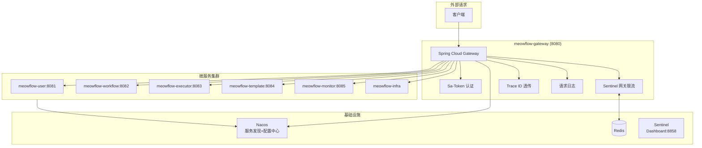

# 喵流 (MeowFlow) - 技术架构文档

> 本文档详细描述喵流平台的技术架构设计，参考了 Ragent 等优秀开源项目的设计理念

---

## 一、设计理念

### 1.1 核心理念

```
┌─────────────────────────────────────────────────────────────────────────┐
│                          设计理念                                        │
├─────────────────────────────────────────────────────────────────────────┤
│                                                                          │
│  基于 Ragent 等优秀开源项目的工程实践，我们的设计遵循以下核心理念：       │
│                                                                          │
│  ┌─────────────────────────────────────────────────────────────────┐    │
│  │  1. 分层解耦：基础设施与业务逻辑分离，换模型不改业务代码          │    │
│  │  2. 接口抽象：面向接口编程，节点可插拔替换                        │    │
│  │  3. 工程规范：线程池、限流、熔断、追踪，一个都不能少              │    │
│  │  4. 生产优先：从第一天就考虑高可用、高并发、可观测                │    │
│  └─────────────────────────────────────────────────────────────────┘    │
│                                                                          │
└─────────────────────────────────────────────────────────────────────────┘
```

### 1.2 参考项目

| 项目 | 参考点 | 应用到喵流 |
|------|--------|-------------|
| Ragent | 三层架构 | 业务层 / 节点执行层 / 基础设施层 |
| Ragent | 模型路由 + 熔断 | LLM 节点的多模型切换 |
| Ragent | 多路检索 | 知识库检索节点 |
| Ragent | Pipeline 编排 | 工作流执行引擎 |
| Ragent | 8 个专用线程池 | 执行器线程池设计 |
| Ragent | 框架层封装 | 通用能力下沉到 common 模块 |

---

## 二、系统架构

### 2.1 整体架构图

```
┌─────────────────────────────────────────────────────────────────────────┐
│                              用户层                                      │
├─────────────────────────────────────────────────────────────────────────┤
│                                                                          │
│  ┌───────────────┐  ┌───────────────┐  ┌───────────────┐              │
│  │   Web 浏览器  │  │   移动端 H5   │  │   小程序      │              │
│  │   (Vue 3)    │  │   (Vue 3)    │  │   (UniApp)   │              │
│  └───────────────┘  └───────────────┘  └───────────────┘              │
│                                                                          │
└─────────────────────────────────────────────────────────────────────────┘
                                    │
                                    ▼
┌─────────────────────────────────────────────────────────────────────────┐
│                              负载层                                      │
├─────────────────────────────────────────────────────────────────────────┤
│                                                                          │
│                         ┌───────────────┐                               │
│                         │    Nginx     │                               │
│                         ├───────────────┤                               │
│                         │ • 负载均衡   │                               │
│                         │ • SSL 终结   │                               │
│                         │ • 静态资源   │                               │
│                         │ • Gzip 压缩  │                               │
│                         │ • 请求限流   │                               │
│                         └───────────────┘                               │
│                                                                          │
└─────────────────────────────────────────────────────────────────────────┘
                                    │
                                    ▼
┌─────────────────────────────────────────────────────────────────────────┐
│                              网关层                                      │
├─────────────────────────────────────────────────────────────────────────┤
│                                                                          │
│  ┌─────────────────────────────────────────────────────────────────┐   │
│  │                     Spring Cloud Gateway                         │   │
│  │                                                                  │   │
│  │  • 路由转发        • 统一认证        • 限流熔断                 │   │
│  │  • 跨域处理        • 统一鉴权        • 请求日志                 │   │
│  │                                                                  │   │
│  └─────────────────────────────────────────────────────────────────┘   │
│                                                                          │
└─────────────────────────────────────────────────────────────────────────┘
                                    │
                                    ▼
┌─────────────────────────────────────────────────────────────────────────┐
│                              服务层 (三层架构)                            │
├─────────────────────────────────────────────────────────────────────────┤
│                                                                          │
│  ═══════════════════════════════════════════════════════════════════════  │
│                              业务服务层                                  │
│  ═══════════════════════════════════════════════════════════════════════  │
│                                                                          │
│  ┌─────────────────┐  ┌─────────────────┐  ┌─────────────────┐        │
│  │  Workflow       │  │  Template      │  │  Executor       │        │
│  │  Service       │  │  Service      │  │  Service       │        │
│  │                │  │                │  │                │        │
│  │ • 工作流 CRUD │  │ • 模板管理   │  │ • 任务调度   │        │
│  │ • 版本管理    │  │ • 分类管理   │  │ • 流程执行   │        │
│  │ • 导入导出   │  │ • 审核发布   │  │ • 节点调度   │        │
│  │                │  │                │  │                │        │
│  └─────────────────┘  └─────────────────┘  └─────────────────┘        │
│                                                                          │
│  ┌─────────────────┐  ┌─────────────────┐  ┌─────────────────┐        │
│  │  User          │  │  Monitor        │  │  Integration    │        │
│  │  Service       │  │  Service       │  │  Service       │        │
│  │                │  │                │  │                │        │
│  │ • 用户管理    │  │ • 执行日志   │  │ • AI 模型配置 │        │
│  │ • 组织管理    │  │ • 告警通知   │  │ • 第三方集成 │        │
│  │ • 权限管理    │  │ • 指标采集   │  │ • Webhook    │        │
│  │                │  │                │  │                │        │
│  └─────────────────┘  └─────────────────┘  └─────────────────┘        │
│                                                                          │
│  ═══════════════════════════════════════════════════════════════════════  │
│                          节点执行层 (参考 Ragent Infra-AI)              │
│  ═══════════════════════════════════════════════════════════════════════  │
│                                                                          │
│  ┌─────────────────────────────────────────────────────────────────┐    │
│  │  NodeRegistry（节点注册中心）                                    │    │
│  │  • 自动发现与注册                                               │    │
│  │  • 新增节点零配置                                               │    │
│  └─────────────────────────────────────────────────────────────────┘    │
│                                                                          │
│  ┌─────────────────┐  ┌─────────────────┐  ┌─────────────────┐        │
│  │  AI 节点       │  │  流程控制节点   │  │  工具节点       │        │
│  │                │  │                │  │                │        │
│  │ • LLMExecutor │  │ • Condition    │  │ • HTTP        │        │
│  │ • 模型路由    │  │ • Loop        │  │ • Database    │        │
│  │ • 熔断降级   │  │ • Parallel    │  │ • Code        │        │
│  │ • 健康检查   │  │ • Wait        │  │ • Variable    │        │
│  │                │  │                │  │                │        │
│  │ ┌───────────┐│  └─────────────────┘  └─────────────────┘        │
│  │ │Search节点 ││                                                  │
│  │ │多路检索   ││  ┌─────────────────┐  ┌─────────────────┐        │
│  │ │向量+关键词││  │  触发器节点     │  │  通知节点       │        │
│  │ └───────────┘│  │                │  │                │        │
│  │                │  │ • Webhook     │  │ • Dingtalk    │        │
│  │ ┌───────────┐│  │ • Schedule    │  │ • Feishu     │        │
│  │ │MCP节点    ││  │ • Form        │  │ • Email       │        │
│  │ │工具调用   ││  │ • Message     │  │ • SMS         │        │
│  │ └───────────┘│  │                │  │ • WxWork     │        │
│  └─────────────────┘  └─────────────────┘  └─────────────────┘        │
│                                                                          │
│  ═══════════════════════════════════════════════════════════════════════  │
│                          基础设施层 (参考 Ragent Framework)              │
│  ═══════════════════════════════════════════════════════════════════════  │
│                                                                          │
│  ┌─────────────────────────────────────────────────────────────────┐    │
│  │  Framework 公共能力                                              │    │
│  │  • 三级异常体系 + 统一异常拦截                                   │    │
│  │  • 双维度幂等                                                   │    │
│  │  • Snowflake 分布式 ID                                          │    │
│  │  • 用户上下文 + Trace 上下文跨线程透传                          │    │
│  │  • 线程安全 SSE 封装                                            │    │
│  │  • 统一响应体 + 错误码规范                                      │    │
│  └─────────────────────────────────────────────────────────────────┘    │
│                                                                          │
│  ┌─────────────────┐  ┌─────────────────┐  ┌─────────────────┐        │
│  │  线程池管理    │  │   限流熔断     │  │   链路追踪     │        │
│  │                │  │                │  │                │        │
│  │ • 8个专用线程 │  │ • 队列式限流   │  │ • @TraceNode  │        │
│  │ • TTL透传     │  │ • 三态熔断器   │  │ • Trace ID     │        │
│  │ • 上下文透传 │  │ • 降级链       │  │ • Span 追踪    │        │
│  │                │  │                │  │                │        │
│  └─────────────────┘  └─────────────────┘  └─────────────────┘        │
│                                                                          │
└─────────────────────────────────────────────────────────────────────────┘
                                    │
                                    ▼
┌─────────────────────────────────────────────────────────────────────────┐
│                              数据层                                      │
├─────────────────────────────────────────────────────────────────────────┤
│                                                                          │
│  ┌─────────────────┐  ┌─────────────────┐  ┌─────────────────┐        │
│  │  PostgreSQL    │  │     Redis      │  │     MinIO       │        │
│  │  主数据库      │  │  缓存/会话     │  │  文件存储       │        │
│  │                │  │                │  │                │        │
│  │ • 业务数据   │  │ • Token 缓存  │  │ • 日志文件   │        │
│  │ • 工作流定义  │  │ • 执行锁      │  │ • 导出文件   │        │
│  │ • 执行记录    │  │ • 热点数据   │  │ • 备份数据   │        │
│  │                │  │                │  │                │        │
│  └─────────────────┘  └─────────────────┘  └─────────────────┘        │
│                                                                          │
│  ┌─────────────────┐                                                  │
│  │   RabbitMQ     │                                                  │
│  │   消息队列     │                                                  │
│  │                │                                                  │
│  │ • 任务队列   │                                                  │
│  │ • 事件通知   │                                                  │
│  │ • 异步处理   │                                                  │
│  │                │                                                  │
│  └─────────────────┘                                                  │
│                                                                          │
└─────────────────────────────────────────────────────────────────────────┘
```

### 2.2 与 Ragent 架构对比

```
┌─────────────────────────────────────────────────────────────────────────┐
│                    Ragent vs 喵流 架构对比                              │
├─────────────────────────────────────────────────────────────────────────┤
│                                                                          │
│  ┌────────────────┐  ┌────────────────────────────────────────────┐   │
│  │    Ragent      │  │              喵流                        │   │
│  ├────────────────┤  ├────────────────────────────────────────────┤   │
│  │                │  │                                            │   │
│  │ Bootstrap      │  │  业务服务层                                │   │
│  │ (业务层)       │  │  • WorkflowService                         │   │
│  │                │  │  • TemplateService                         │   │
│  │                │  │  • ExecutorService                         │   │
│  │                │  │                                            │   │
│  ├────────────────┤  ├────────────────────────────────────────────┤   │
│  │                │  │                                            │   │
│  │ Infra-AI       │  │  节点执行层                                │   │
│  │ (AI 基础设施)  │  │  • NodeRegistry（节点注册中心）            │   │
│  │                │  │  • LLMExecutor + 模型路由 + 熔断降级       │   │
│  │                │  │  • SearchExecutor（多路检索）              │   │
│  │                │  │  • MCPToolExecutor（MCP 工具调用）         │   │
│  │                │  │                                            │   │
│  ├────────────────┤  ├────────────────────────────────────────────┤   │
│  │                │  │                                            │   │
│  │ Framework      │  │  基础设施层                               │   │
│  │ (通用框架)      │  │  • 8 个专用线程池 + TTL 透传               │   │
│  │                │  │  • 队列式限流 + 三态熔断器                 │   │
│  │                │  │  • AOP 链路追踪 + Trace ID                 │   │
│  │                │  │  • 用户上下文 + Trace 上下文透传            │   │
│  │                │  │                                            │   │
│  └────────────────┘  └────────────────────────────────────────────┘   │
│                                                                          │
│  核心思想一致：换模型不改业务，换节点不改引擎，换业务不改基础设施          │
│                                                                          │
└─────────────────────────────────────────────────────────────────────────┘
```

---

## 三、技术选型

### 3.1 技术栈总览

```
┌─────────────────────────────────────────────────────────────────────────┐
│                          技术选型总览                                    │
├─────────────────────────────────────────────────────────────────────────┤
│                                                                          │
│  ┌─────────────────────────────────────────────────────────────────┐    │
│  │                        前端 (Frontend)                            │    │
│  ├─────────────────────────────────────────────────────────────────┤    │
│  │                                                                   │    │
│  │  框架: Vue 3 + Composition API + TypeScript                       │    │
│  │  UI 库: Element Plus                                             │    │
│  │  可视化: AntV G6 / LogicFlow                                     │    │
│  │  状态管理: Pinia                                                 │    │
│  │  构建工具: Vite                                                  │    │
│  │                                                                   │    │
│  └─────────────────────────────────────────────────────────────────┘    │
│                                                                          │
│  ┌─────────────────────────────────────────────────────────────────┐    │
│  │                        后端 (Backend)                            │    │
│  ├─────────────────────────────────────────────────────────────────┤    │
│  │                                                                   │    │
│  │  核心框架:                                                       │    │
│  │  ├── Java 17+ / Spring Boot 3.x                                │    │
│  │  ├── Spring Cloud Alibaba (可选微服务)                          │    │
│  │  └── Sa-Token (认证授权)                                        │    │
│  │                                                                   │    │
│  │  数据访问:                                                        │    │
│  │  ├── MyBatis-Plus (ORM)                                         │    │
│  │  └── PostgreSQL 15+ (主数据库，支持 JSONB)                      │    │
│  │                                                                   │    │
│  │  缓存与队列:                                                      │    │
│  │  ├── Redis 7+                                                   │    │
│  │  └── RabbitMQ 3.12                                              │    │
│  │                                                                   │    │
│  │  AI 能力 (参考 Ragent):                                          │    │
│  │  ├── 统一的 ChatClient 接口抽象                                 │    │
│  │  ├── 多模型路由 + 三态熔断器                                     │    │
│  │  ├── 多路检索 (向量 + 关键词 + 混合)                             │    │
│  │  └── MCP 协议集成                                                │    │
│  │                                                                   │    │
│  └─────────────────────────────────────────────────────────────────┘    │
│                                                                          │
│  ┌─────────────────────────────────────────────────────────────────┐    │
│  │                        基础设施                                   │    │
│  ├─────────────────────────────────────────────────────────────────┤    │
│  │                                                                   │    │
│  │  ├── Nginx (反向代理)                                           │    │
│  │  ├── MinIO (对象存储)                                            │    │
│  │  ├── PostgreSQL (主库+日志)                                    │    │
│  │  └── Docker / Kubernetes (容器化部署)                           │    │
│  │                                                                   │    │
│  └─────────────────────────────────────────────────────────────────┘    │
│                                                                          │
└─────────────────────────────────────────────────────────────────────────┘
```

---

## 四、核心模块设计

### 4.1 分层架构详解

#### 4.1.1 业务服务层

```
┌─────────────────────────────────────────────────────────────────────────┐
│                          业务服务层                                      │
├─────────────────────────────────────────────────────────────────────────┤
│                                                                          │
│  WorkflowService（工作流服务）                                           │
│  ───────────────────────────────────────────────────────────────────────│
│  • 工作流 CRUD、版本管理、导入导出                                     │
│  • 分组管理、分类管理                                                  │
│  • 发布/停止/复制                                                      │
│                                                                          │
│  TemplateService（模板服务）                                            │
│  ───────────────────────────────────────────────────────────────────────│
│  • 模板发布/审核/下架                                                  │
│  • 模板分类/标签/评分                                                  │
│  • 一键使用/复制修改                                                  │
│                                                                          │
│  ExecutorService（执行服务）                                           │
│  ───────────────────────────────────────────────────────────────────────│
│  • 手动执行/定时执行/Webhook 触发                                      │
│  • 执行状态管理                                                        │
│  • 执行记录查询                                                        │
│                                                                          │
│  MonitorService（监控服务）                                             │
│  ───────────────────────────────────────────────────────────────────────│
│  • 执行日志收集                                                        │
│  • 告警规则配置/触发                                                  │
│  • 统计指标计算                                                        │
│                                                                          │
└─────────────────────────────────────────────────────────────────────────┘
```

#### 4.1.2 节点执行层（参考 Ragent Infra-AI）

```
┌─────────────────────────────────────────────────────────────────────────┐
│                          节点执行层                                      │
├─────────────────────────────────────────────────────────────────────────┤
│                                                                          │
│  ┌─────────────────────────────────────────────────────────────────┐    │
│  │  节点注册中心 (NodeRegistry)                                      │    │
│  │  ───────────────────────────────────────────────────────────────│    │
│  │                                                                   │    │
│  │  核心功能：                                                       │    │
│  │  • 自动扫描并注册所有 NodeExecutor 实现                         │    │
│  │  • 提供统一的节点获取接口                                        │    │
│  │  • 支持运行时动态注册/注销节点                                   │    │
│  │                                                                   │    │
│  │  代码示例：                                                       │    │
│  │                                                                   │    │
│  │  @Component                                                       │    │
│  │  public class NodeRegistry {                                     │    │
│  │                                                                   │    │
│  │      private final Map<String, NodeExecutor>                     │    │
│  │          executors = new ConcurrentHashMap<>();                  │    │
│  │                                                                   │    │
│  │      @PostConstruct                                              │    │
│  │      public void init() {                                        │    │
│  │          // LLM 节点                                            │    │
│  │          register("llm", new LLMExecutor());                   │    │
│  │          register("llm-classify", new LLMClassifyExecutor());   │    │
│  │          register("llm-extract", new LLMExtractExecutor());      │    │
│  │          register("llm-summarize", new LLMSummarizeExecutor()); │    │
│  │                                                                   │    │
│  │          // 流程控制节点                                         │    │
│  │          register("condition", new ConditionExecutor());         │    │
│  │          register("loop", new LoopExecutor());                   │    │
│  │          register("parallel", new ParallelExecutor());           │    │
│  │          register("wait", new WaitExecutor());                   │    │
│  │                                                                   │    │
│  │          // 工具节点                                             │    │
│  │          register("http", new HTTPExecutor());                   │    │
│  │          register("database", new DatabaseExecutor());            │    │
│  │          register("code", new CodeExecutor());                   │    │
│  │          register("variable", new VariableExecutor());            │    │
│  │                                                                   │    │
│  │          // 通知节点                                             │    │
│  │          register("dingtalk", new DingtalkNotifyExecutor());    │    │
│  │          register("feishu", new FeishuNotifyExecutor());        │    │
│  │          register("email", new EmailNotifyExecutor());           │    │
│  │          register("sms", new SMSNotifyExecutor());               │    │
│  │          register("wxwork", new WxWorkNotifyExecutor());        │    │
│  │                                                                   │    │
│  │          // 知识库检索节点                                       │    │
│  │          register("knowledge-search", new KnowledgeSearchExecutor()); │  │
│  │                                                                   │    │
│  │          // MCP 工具节点                                         │    │
│  │          register("mcp-tool", new MCPToolExecutor());            │    │
│  │      }                                                           │    │
│  │                                                                   │    │
│  │      public void register(String type, NodeExecutor executor) {  │    │
│  │          executors.put(type, executor);                           │    │
│  │      }                                                           │    │
│  │                                                                   │    │
│  │      public NodeExecutor get(String type) {                       │    │
│  │          NodeExecutor executor = executors.get(type);             │    │
│  │          if (executor == null) {                                 │    │
│  │              throw new NodeNotFoundException(type);              │    │
│  │          }                                                       │    │
│  │          return executor;                                        │    │
│  │      }                                                           │    │
│  │  }                                                               │    │
│  │                                                                   │    │
│  └─────────────────────────────────────────────────────────────────┘    │
│                                                                          │
│  ┌─────────────────────────────────────────────────────────────────┐    │
│  │  节点执行器基类接口                                              │    │
│  │  ───────────────────────────────────────────────────────────────│    │
│  │                                                                   │    │
│  │  public interface NodeExecutor {                                  │    │
│  │                                                                   │    │
│  │      /**                                                        │    │
│  │       * 获取节点类型                                            │    │
│  │       */                                                        │    │
│  │      String getNodeType();                                       │    │
│  │                                                                   │    │
│  │      /**                                                        │    │
│  │       * 执行节点                                                │    │
│  │       * @param context 执行上下文                               │    │
│  │       * @param node 节点定义                                    │    │
│  │       * @return 执行结果                                        │    │
│  │       */                                                        │    │
│  │      NodeResult execute(ExecutionContext context,                 │    │
│  │                        NodeDefinition node);                      │    │
│  │                                                                   │    │
│  │      /**                                                        │    │
│  │       * 校验节点配置                                            │    │
│  │       */                                                        │    │
│  │      void validate(NodeDefinition node);                          │    │
│  │  }                                                              │    │
│  │                                                                   │    │
│  └─────────────────────────────────────────────────────────────────┘    │
│                                                                          │
└─────────────────────────────────────────────────────────────────────────┘
```

#### 4.1.3 基础设施层（参考 Ragent Framework）

```
┌─────────────────────────────────────────────────────────────────────────┐
│                          基础设施层                                      │
├─────────────────────────────────────────────────────────────────────────┤
│                                                                          │
│  ┌─────────────────────────────────────────────────────────────────┐    │
│  │  1. 线程池管理 (8 个专用线程池)                                 │    │
│  │  ───────────────────────────────────────────────────────────────│    │
│  │                                                                   │    │
│  │  ┌─────────────┐ ┌─────────────┐ ┌─────────────┐                │    │
│  │  │ 工作流执行 │ │ LLM 调用   │ │ HTTP 请求   │                │    │
│  │  │ max-20    │ │ max-50    │ │ max-100   │                │    │
│  │  │ queue-1000│ │ queue-2000│ │ queue-5000│                │    │
│  │  └─────────────┘ └─────────────┘ └─────────────┘                │    │
│  │                                                                   │    │
│  │  ┌─────────────┐ ┌─────────────┐ ┌─────────────┐                │    │
│  │  │ MCP 批量   │ │ 知识库检索 │ │ 通知发送   │                │    │
│  │  │ max-20    │ │ max-100   │ │ max-50    │                │    │
│  │  │ queue-100 │ │ queue-500 │ │ queue-200 │                │    │
│  │  └─────────────┘ └─────────────┘ └─────────────┘                │    │
│  │                                                                   │    │
│  │  ┌─────────────┐ ┌─────────────┐                                │    │
│  │  │ 数据库操作 │ │ 定时任务   │                                │    │
│  │  │ max-30    │ │ max-20    │                                │    │
│  │  │ queue-200 │ │ queue-100 │                                │    │
│  │  └─────────────┘ └─────────────┘                                │    │
│  │                                                                   │    │
│  │  关键：所有线程池都用 TtlExecutors 包装，确保用户上下文透传       │    │
│  │                                                                   │    │
│  └─────────────────────────────────────────────────────────────────┘    │
│                                                                          │
│  ┌─────────────────────────────────────────────────────────────────┐    │
│  │  2. 限流熔断 (参考 Ragent)                                       │    │
│  │  ───────────────────────────────────────────────────────────────│    │
│  │                                                                   │    │
│  │  队列式限流：                                                    │    │
│  │  ┌────────────────────────────────────────────────────────────┐  │    │
│  │  │  请求 ──► Redis ZSET 排队 ──► Lua 脚本判断 ──► 出队执行  │  │    │
│  │  └────────────────────────────────────────────────────────────┘  │    │
│  │                                                                   │    │
│  │  三态熔断器：                                                    │    │
│  │  ┌────────────────────────────────────────────────────────────┐  │    │
│  │  │  CLOSED ──► OPEN ──► HALF_OPEN                          │  │    │
│  │  │   正常     熔断     探测                                 │  │    │
│  │  └────────────────────────────────────────────────────────────┘  │    │
│  │                                                                   │    │
│  └─────────────────────────────────────────────────────────────────┘    │
│                                                                          │
│  ┌─────────────────────────────────────────────────────────────────┐    │
│  │  3. 链路追踪 (参考 Ragent)                                      │    │
│  │  ───────────────────────────────────────────────────────────────│    │
│  │                                                                   │    │
│  │  @TraceNode("LLM 调用")                                        │    │
│  │  public NodeResult executeLLM(...) {                            │    │
│  │      // 节点执行逻辑                                            │    │
│  │  }                                                             │    │
│  │                                                                   │    │
│  │  AOP 自动记录：                                                 │    │
│  │  • Trace ID                                                    │    │
│  │  • 节点 ID                                                     │    │
│  │  • 开始/结束时间                                               │    │
│  │  • 输入/输出数据                                               │    │
│  │  • 异常信息                                                    │    │
│  │                                                                   │    │
│  └─────────────────────────────────────────────────────────────────┘    │
│                                                                          │
│  ┌─────────────────────────────────────────────────────────────────┐    │
│  │  4. 上下文透传 (参考 Ragent)                                    │    │
│  │  ───────────────────────────────────────────────────────────────│    │
│  │                                                                   │    │
│  │  UserContext: 用户上下文                                        │    │
│  │  TraceContext: 链路追踪上下文                                    │    │
│  │                                                                   │    │
│  │  通过 TransmittableThreadLocal 实现跨线程透传：                 │    │
│  │  ┌────────────────────────────────────────────────────────────┐  │    │
│  │  │  主线程 ──► 线程池 ──► 异步线程                            │  │    │
│  │  │      │                    │                               │  │    │
│  │  │      │  TTL 包装          │  自动获取                      │  │    │
│  │  │      └────────────────────┘                               │  │    │
│  │  └────────────────────────────────────────────────────────────┘  │    │
│  │                                                                   │    │
│  └─────────────────────────────────────────────────────────────────┘    │
│                                                                          │
└─────────────────────────────────────────────────────────────────────────┘
```

### 4.2 LLM 节点设计（参考 Ragent 模型路由）

```
┌─────────────────────────────────────────────────────────────────────────┐
│                          LLM 节点设计                                   │
├─────────────────────────────────────────────────────────────────────────┤
│                                                                          │
│  ┌─────────────────────────────────────────────────────────────────┐    │
│  │  模型路由与容错架构                                               │    │
│  │  ───────────────────────────────────────────────────────────────│    │
│  │                                                                   │    │
│  │       用户请求                                                   │    │
│  │          │                                                       │    │
│  │          ▼                                                       │    │
│  │   ┌─────────────────┐                                          │    │
│  │   │   意图识别     │  ← 确定使用哪个模型                        │    │
│  │   └────────┬────────┘                                          │    │
│  │            │                                                    │    │
│  │            ▼                                                    │    │
│  │   ┌─────────────────┐                                          │    │
│  │   │   模型路由      │  ← 按优先级选择模型                       │    │
│  │   └────────┬────────┘                                          │    │
│  │            │                                                    │    │
│  │            ▼                                                    │    │
│  │   ┌─────────────────┐                                          │    │
│  │   │   熔断器保护    │  ← 三态熔断：CLOSED/OPEN/HALF_OPEN       │    │
│  │   └────────┬────────┘                                          │    │
│  │            │                                                    │    │
│  │   ┌────────┴────────┐                                          │    │
│  │   ▼                  ▼                                          │    │
│  │ ┌──────┐       ┌──────┐                                       │    │
│  │ │GPT-4o│       │Claude│  ← 候选模型列表                       │    │
│  │ │(首选)│       │(备选)│                                       │    │
│  │ └──────┘       └──────┘                                       │    │
│  │     │               │                                           │    │
│  │     └───────────────┘                                           │    │
│  │             │                                                   │    │
│  │             ▼                                                   │    │
│  │      ┌──────────────┐                                          │    │
│  │      │  首包探测    │  ← 发现模型慢自动切换                     │    │
│  │      └──────────────┘                                          │    │
│  │             │                                                   │    │
│  │             ▼                                                   │    │
│  │      ┌──────────────┐                                          │    │
│  │      │  SSE 流输出  │                                          │    │
│  │      └──────────────┘                                          │    │
│  │                                                                   │    │
│  └─────────────────────────────────────────────────────────────────┘    │
│                                                                          │
│  ┌─────────────────────────────────────────────────────────────────┐    │
│  │  LLM 节点配置                                                   │    │
│  │  ───────────────────────────────────────────────────────────────│    │
│  │                                                                   │    │
│  │  public class LLMNodeConfig {                                   │    │
│  │      // 候选模型列表（按优先级排序）                             │    │
│  │      private List<ModelCandidate> candidates;                   │    │
│  │                                                                   │    │
│  │      // 熔断配置                                                │    │
│  │      private CircuitBreakerConfig circuitBreaker;                │    │
│  │                                                                   │    │
│  │      // 降级策略                                                │    │
│  │      private FallbackStrategy fallback;                          │    │
│  │                                                                   │    │
│  │      // 超时配置                                                │    │
│  │      private int timeoutSeconds = 60;                           │    │
│  │                                                                   │    │
│  │      // 重试配置                                                │    │
│  │      private int retryCount = 2;                                │    │
│  │  }                                                              │    │
│  │                                                                   │    │
│  │  public class ModelCandidate {                                   │    │
│  │      private String name;              // 模型名称               │    │
│  │      private String provider;           // openai/anthropic/ali │    │
│  │      private int priority = 1;         // 优先级：数字越小越高  │    │
│  │      private int timeout = 60;         // 超时时间（秒）       │    │
│  │      private double weight = 1.0;      // 负载权重             │    │
│  │  }                                                              │    │
│  │                                                                   │    │
│  └─────────────────────────────────────────────────────────────────┘    │
│                                                                          │
│  ┌─────────────────────────────────────────────────────────────────┐    │
│  │  ChatClient 抽象（参考 Ragent）                                 │    │
│  │  ───────────────────────────────────────────────────────────────│    │
│  │                                                                   │    │
│  │  public interface ChatClient {                                   │    │
│  │      /**                                                        │    │
│  │       * 同步对话                                               │    │
│  │       */                                                        │    │
│  │      ChatResponse chat(ChatRequest request);                    │    │
│  │                                                                   │    │
│  │      /**                                                        │    │
│  │       * 流式对话                                               │    │
│  │       */                                                        │    │
│  │      void chatStream(ChatRequest request, StreamCallback callback); │  │
│  │                                                                   │    │
│  │      /**                                                        │    │
│  │       * 健康检查                                               │    │
│  │       */                                                        │    │
│  │      boolean healthCheck();                                      │    │
│  │  }                                                              │    │
│  │                                                                   │    │
│  │  // 实现类                                                      │    │
│  │  public class ChatClientOpenAI implements ChatClient { ... }   │    │
│  │  public class ChatClientAnthropic implements ChatClient { ... } │    │
│  │  public class ChatClientAli implements ChatClient { ... }       │    │
│  │  public class ChatClientBaidu implements ChatClient { ... }     │    │
│  │                                                                   │    │
│  └─────────────────────────────────────────────────────────────────┘    │
│                                                                          │
└─────────────────────────────────────────────────────────────────────────┘
```

### 4.3 知识库检索节点（参考 Ragent 多路检索）

```
┌─────────────────────────────────────────────────────────────────────────┐
│                        知识库检索节点设计                                │
├─────────────────────────────────────────────────────────────────────────┤
│                                                                          │
│  ┌─────────────────────────────────────────────────────────────────┐    │
│  │  多路检索架构                                                     │    │
│  │  ───────────────────────────────────────────────────────────────│    │
│  │                                                                   │    │
│  │                         用户问题                                  │    │
│  │                            │                                      │    │
│  │                            ▼                                      │    │
│  │                   ┌─────────────────┐                             │    │
│  │                   │   问题预处理    │                             │    │
│  │                   │  • 意图识别   │                             │    │
│  │                   │  • 关键词提取 │                             │    │
│  │                   │  • 同义词扩展 │                             │    │
│  │                   └────────┬────────┘                             │    │
│  │                            │                                      │    │
│  │          ┌─────────────────┼─────────────────┐                  │    │
│  │          │                 │                 │                   │    │
│  │          ▼                 ▼                 ▼                   │    │
│  │   ┌─────────────┐   ┌─────────────┐   ┌─────────────┐           │    │
│  │   │  向量检索   │   │  关键词检索 │   │   知识图谱  │           │    │
│  │   │  (Vector)  │   │  (BM25)    │   │   (Graph)   │           │    │
│  │   └──────┬──────┘   └──────┬──────┘   └──────┬──────┘           │    │
│  │          │                 │                 │                   │    │
│  │          └─────────────────┼─────────────────┘                   │    │
│  │                            │                                      │    │
│  │                            ▼                                      │    │
│  │                   ┌─────────────────┐                             │    │
│  │                   │   后处理链     │                             │    │
│  │                   │  • 去重        │                             │    │
│  │                   │  • 融合排序    │                             │    │
│  │                   │  • 重排序      │                             │    │
│  │                   │  • 质量过滤    │                             │    │
│  │                   └────────┬────────┘                             │    │
│  │                            │                                      │    │
│  │                            ▼                                      │    │
│  │                      检索结果                                     │    │
│  │                                                                   │    │
│  └─────────────────────────────────────────────────────────────────┘    │
│                                                                          │
│  ┌─────────────────────────────────────────────────────────────────┐    │
│  │  检索通道接口（策略模式）                                        │    │
│  │  ───────────────────────────────────────────────────────────────│    │
│  │                                                                   │    │
│  │  public interface SearchChannel {                                │    │
│  │      String getChannelName();                                    │    │
│  │      SearchResult search(SearchQuery query, int topK);          │    │
│  │      boolean isEnabled();                                        │    │
│  │  }                                                              │    │
│  │                                                                   │    │
│  │  // 实现类                                                      │    │
│  │  public class VectorSearchChannel implements SearchChannel {    │    │
│  │      @Override                                                   │    │
│  │      public SearchResult search(SearchQuery query, int topK) {  │    │
│  │          // 1. 获取问题向量                                      │    │
│  │          float[] embedding = embeddingClient.embed(query);       │    │
│  │                                                                   │    │
│  │          // 2. 向量相似度搜索                                    │    │
│  │          return vectorDB.search(embedding, topK);               │    │
│  │      }                                                           │    │
│  │  }                                                              │    │
│  │                                                                   │    │
│  │  public class KeywordSearchChannel implements SearchChannel {   │    │
│  │      @Override                                                   │    │
│  │      public SearchResult search(SearchQuery query, int topK) {  │    │
│  │          // BM25 关键词检索                                      │    │
│  │          return searchEngine.search(query.getText(), topK);     │    │
│  │      }                                                           │    │
│  │  }                                                              │    │
│  │                                                                   │    │
│  └─────────────────────────────────────────────────────────────────┘    │
│                                                                          │
│  ┌─────────────────────────────────────────────────────────────────┐    │
│  │  后处理器接口（责任链模式）                                       │    │
│  │  ───────────────────────────────────────────────────────────────│    │
│  │                                                                   │    │
│  │  public interface SearchResultPostProcessor {                   │    │
│  │      List<SearchResult> process(List<SearchResult> results);    │    │
│  │  }                                                              │    │
│  │                                                                   │    │
│  │  // 后处理器链                                                  │    │
│  │  public class PostProcessorChain {                              │    │
│  │      private List<SearchResultPostProcessor> processors;        │    │
│  │                                                                   │    │
│  │      public List<SearchResult> execute(List<SearchResult> results) {  │  │
│  │          for (PostProcessor processor : processors) {            │    │
│  │              results = processor.process(results);              │    │
│  │          }                                                       │    │
│  │          return results;                                         │    │
│  │      }                                                           │    │
│  │  }                                                               │    │
│  │                                                                   │    │
│  │  // 具体实现                                                    │    │
│  │  public class DeduplicateProcessor implements SearchResultPostProcessor { }  │
│  │  public class RerankProcessor implements SearchResultPostProcessor { }       │
│  │  public class QualityFilterProcessor implements SearchResultPostProcessor { } │
│  │                                                                   │    │
│  └─────────────────────────────────────────────────────────────────┘    │
│                                                                          │
└─────────────────────────────────────────────────────────────────────────┘
```

### 4.4 执行引擎设计（参考 Ragent Pipeline）

```
┌─────────────────────────────────────────────────────────────────────────┐
│                          执行引擎设计                                    │
├─────────────────────────────────────────────────────────────────────────┤
│                                                                          │
│  ┌─────────────────────────────────────────────────────────────────┐    │
│  │  工作流执行流程                                                  │    │
│  │  ───────────────────────────────────────────────────────────────│    │
│  │                                                                   │    │
│  │   触发请求                                                      │    │
│  │       │                                                        │    │
│  │       ▼                                                        │    │
│  │   ┌─────────────────┐                                          │    │
│  │   │ 加载工作流定义  │  ← 从数据库加载 JSON                     │    │
│  │   └────────┬────────┘                                          │    │
│  │            │                                                   │    │
│  │            ▼                                                   │    │
│  │   ┌─────────────────┐                                          │    │
│  │   │  解析 DAG       │  ← 构建节点依赖图                       │    │
│  │   └────────┬────────┘                                          │    │
│  │            │                                                   │    │
│  │            ▼                                                   │    │
│  │   ┌─────────────────┐                                          │    │
│  │   │  拓扑排序       │  ← 确定执行顺序                         │    │
│  │   └────────┬────────┘                                          │    │
│  │            │                                                   │    │
│  │            ▼                                                   │    │
│  │   ┌─────────────────┐                                          │    │
│  │   │  节点执行循环   │                                          │    │
│  │   │                  │                                          │    │
│  │   │  for node in order:│                                       │    │
│  │   │      │            │                                        │    │
│  │   │      ▼            │                                        │    │
│  │   │   获取执行器      │  ← NodeRegistry.get(node.type)         │    │
│  │   │      │            │                                        │    │
│  │   │      ▼            │                                        │    │
│  │   │   执行节点        │  ← executor.execute(context, node)      │    │
│  │   │      │            │                                        │    │
│  │   │      ▼            │                                        │    │
│  │   │   保存输出        │  ← context.setVariable(node.output)     │    │
│  │   │      │            │                                        │    │
│  │   │      ▼            │                                        │    │
│  │   │   错误处理        │  ← 失败重试 / 熔断 / 回滚               │    │
│  │   │                  │                                          │    │
│  │   └──────────────────┘                                          │    │
│  │            │                                                   │    │
│  │            ▼                                                   │    │
│  │   ┌─────────────────┐                                          │    │
│  │   │  返回执行结果   │                                          │    │
│  │   └─────────────────┘                                          │    │
│  │                                                                   │    │
│  └─────────────────────────────────────────────────────────────────┘    │
│                                                                          │
│  ┌─────────────────────────────────────────────────────────────────┐    │
│  │  执行引擎核心代码                                                │    │
│  │  ───────────────────────────────────────────────────────────────│    │
│  │                                                                   │    │
│  │  @Service                                                       │    │
│  │  public class WorkflowEngine {                                   │    │
│  │                                                                   │    │
│  │      @Autowired                                                  │    │
│  │      private NodeRegistry nodeRegistry;                          │    │
│  │                                                                   │    │
│  │      @Autowired                                                  │    │
│  │      private WorkflowRepository workflowRepository;               │    │
│  │                                                                   │    │
│  │      @Autowired                                                  │    │
│  │      private UserContextHolder userContextHolder;                 │    │
│  │                                                                   │    │
│  │      public ExecutionResult execute(String workflowId,            │    │
│  │                                   Map<String, Object> input) {   │    │
│  │                                                                   │    │
│  │          // 1. 加载工作流                                        │    │
│  │          Workflow workflow = workflowRepository.findById(workflowId); │  │
│  │          WorkflowDefinition definition = workflow.getDefinition(); │  │
│  │                                                                   │    │
│  │          // 2. 创建执行上下文                                    │    │
│  │          ExecutionContext context = ExecutionContext.builder()     │    │
│  │              .workflowId(workflowId)                             │    │
│  │              .input(input)                                       │    │
│  │              .variables(new HashMap<>())                         │    │
│  │              .traceId(TraceContext.get())                       │    │
│  │              .userId(userContextHolder.getUserId())             │    │
│  │              .build();                                            │    │
│  │                                                                   │    │
│  │          // 3. DAG 拓扑排序                                      │    │
│  │          List<Node> executionOrder = dagSort(                     │    │
│  │              definition.getNodes(),                               │    │
│  │              definition.getEdges()                               │    │
│  │          );                                                      │    │
│  │                                                                   │    │
│  │          // 4. 按序执行                                          │    │
│  │          for (Node node : executionOrder) {                       │    │
│  │                                                                   │    │
│  │              // 4.1 检查前置条件                                 │    │
│  │              if (!checkPreconditions(node, context)) {           │    │
│  │                  continue;                                       │    │
│  │              }                                                    │    │
│  │                                                                   │    │
│  │              // 4.2 获取执行器                                   │    │
│  │              NodeExecutor executor = nodeRegistry.get(node.getType()); │  │
│  │                                                                   │    │
│  │              // 4.3 记录开始                                     │    │
│  │              NodeExecutionLog log = new NodeExecutionLog();     │    │
│  │              log.setNodeId(node.getId());                        │    │
│  │              log.setStartTime(new Date());                        │    │
│  │              logRepository.save(log);                            │    │
│  │                                                                   │    │
│  │              // 4.4 执行节点                                     │    │
│  │              NodeResult result = executor.execute(context, node);  │    │
│  │                                                                   │    │
│  │              // 4.5 保存输出                                      │    │
│  │              context.setVariable(                                 │    │
│  │                  node.getId() + ".output",                       │    │
│  │                  result.getOutput()                              │    │
│  │              );                                                   │    │
│  │                                                                   │    │
│  │              // 4.6 记录结束                                     │    │
│  │              log.setEndTime(new Date());                          │    │
│  │              log.setStatus(result.isSuccess() ? "SUCCESS" : "FAILED"); │  │
│  │              log.setOutput(result.getOutput());                   │    │
│  │              logRepository.save(log);                            │    │
│  │                                                                   │    │
│  │              // 4.7 错误处理                                      │    │
│  │              if (!result.isSuccess() && node.isCritical()) {     │    │
│  │                  throw new WorkflowException(                     │    │
│  │                      "节点执行失败: " + node.getId()            │    │
│  │                  );                                                │    │
│  │              }                                                    │    │
│  │          }                                                        │    │
│  │                                                                   │    │
│  │          return ExecutionResult.success(context.getOutput());     │    │
│  │      }                                                            │    │
│  │                                                                   │    │
│  │      /**                                                         │    │
│  │       * DAG 拓扑排序（Kahn 算法）                                │    │
│  │       */                                                         │    │
│  │      private List<Node> dagSort(List<Node> nodes,                │    │
│  │                                  List<Edge> edges) {            │    │
│  │          // 构建入度表和邻接表                                    │    │
│  │          Map<String, Integer> inDegree = new HashMap<>();        │    │
│  │          Map<String, List<String>> adjacency = new HashMap<>();  │    │
│  │                                                                   │    │
│  │          for (Node node : nodes) {                               │    │
│  │              inDegree.put(node.getId(), 0);                      │    │
│  │              adjacency.put(node.getId(), new ArrayList<>());     │    │
│  │          }                                                        │    │
│  │                                                                   │    │
│  │          for (Edge edge : edges) {                               │    │
│  │              inDegree.merge(edge.getTarget(), 1, Integer::sum);  │    │
│  │              adjacency.get(edge.getSource()).add(edge.getTarget()); │  │
│  │          }                                                        │    │
│  │                                                                   │    │
│  │          // BFS 获取拓扑序                                       │    │
│  │          Queue<String> queue = new LinkedList<>();                │    │
│  │          for (var entry : inDegree.entrySet()) {                │    │
│  │              if (entry.getValue() == 0) {                        │    │
│  │                  queue.offer(entry.getKey());                    │    │
│  │              }                                                    │    │
│  │          }                                                        │    │
│  │                                                                   │    │
│  │          List<Node> result = new ArrayList<>();                  │    │
│  │          while (!queue.isEmpty()) {                              │    │
│  │              String nodeId = queue.poll();                        │    │
│  │              result.add(findNode(nodes, nodeId));                │    │
│  │                                                                   │    │
│  │              for (String neighbor : adjacency.get(nodeId)) {     │    │
│  │                  inDegree.merge(neighbor, -1, Integer::sum);    │    │
│  │                  if (inDegree.get(neighbor) == 0) {             │    │
│  │                      queue.offer(neighbor);                     │    │
│  │                  }                                                │    │
│  │              }                                                    │    │
│  │          }                                                        │    │
│  │                                                                   │    │
│  │          return result;                                          │    │
│  │      }                                                            │    │
│  │  }                                                               │    │
│  │                                                                   │    │
│  └─────────────────────────────────────────────────────────────────┘    │
│                                                                          │
└─────────────────────────────────────────────────────────────────────────┘
```

---

## 五、设计模式应用

```
┌─────────────────────────────────────────────────────────────────────────┐
│                          设计模式应用                                    │
├─────────────────────────────────────────────────────────────────────────┤
│                                                                          │
│  ┌─────────────────────────────────────────────────────────────────┐    │
│  │  策略模式 (Strategy Pattern)                                     │    │
│  │  ───────────────────────────────────────────────────────────────│    │
│  │                                                                   │    │
│  │  应用场景：                                                       │    │
│  │  • SearchChannel：检索通道可插拔                                 │    │
│  │  • NodeExecutor：节点执行器可插拔                               │    │
│  │  • ChatClient：聊天客户端可切换                                 │    │
│  │                                                                   │    │
│  │  好处：新增检索通道 / 节点 / 模型，只需实现接口，零配置         │    │
│  │                                                                   │    │
│  └─────────────────────────────────────────────────────────────────┘    │
│                                                                          │
│  ┌─────────────────────────────────────────────────────────────────┐    │
│  │  注册表模式 (Registry Pattern)                                   │    │
│  │  ───────────────────────────────────────────────────────────────│    │
│  │                                                                   │    │
│  │  应用场景：                                                       │    │
│  │  • NodeRegistry：节点自动注册中心                               │    │
│  │  • MCPToolRegistry：MCP 工具自动发现                           │    │
│  │  • IntentNodeRegistry：意图节点注册                           │    │
│  │                                                                   │    │
│  │  好处：新增节点/工具无需配置文件，自动生效                       │    │
│  │                                                                   │    │
│  └─────────────────────────────────────────────────────────────────┘    │
│                                                                          │
│  ┌─────────────────────────────────────────────────────────────────┐    │
│  │  模板方法模式 (Template Method Pattern)                          │    │
│  │  ───────────────────────────────────────────────────────────────│    │
│  │                                                                   │    │
│  │  应用场景：                                                       │    │
│  │  • NodeExecutor 基类：统一执行流程，子类专注核心逻辑             │    │
│  │  • IngestionPipeline：统一入库流程，各节点串行执行               │    │
│  │                                                                   │    │
│  │  好处：统一规范，子类只需覆盖关键方法                            │    │
│  │                                                                   │    │
│  └─────────────────────────────────────────────────────────────────┘    │
│                                                                          │
│  ┌─────────────────────────────────────────────────────────────────┐    │
│  │  责任链模式 (Chain of Responsibility)                           │    │
│  │  ───────────────────────────────────────────────────────────────│    │
│  │                                                                   │    │
│  │  应用场景：                                                       │    │
│  │  • SearchResultPostProcessor：后处理器链式串联                   │    │
│  │  • FallbackChain：模型降级链                                     │    │
│  │                                                                   │    │
│  │  好处：处理步骤可灵活组合，顺序可配置                           │    │
│  │                                                                   │    │
│  └─────────────────────────────────────────────────────────────────┘    │
│                                                                          │
│  ┌─────────────────────────────────────────────────────────────────┐    │
│  │  装饰器模式 (Decorator Pattern)                                  │    │
│  │  ───────────────────────────────────────────────────────────────│    │
│  │                                                                   │    │
│  │  应用场景：                                                       │    │
│  │  • StreamCallback 包装：增加首包探测能力                         │    │
│  │                                                                   │    │
│  │  好处：在不修改原有回调的前提下增加新能力                        │    │
│  │                                                                   │    │
│  └─────────────────────────────────────────────────────────────────┘    │
│                                                                          │
│  ┌─────────────────────────────────────────────────────────────────┐    │
│  │  工厂模式 (Factory Pattern)                                      │    │
│  │  ───────────────────────────────────────────────────────────────│    │
│  │                                                                   │    │
│  │  应用场景：                                                       │    │
│  │  • NodeExecutorFactory：复杂对象的创建                           │    │
│  │  • StreamCallbackFactory：流式回调创建                           │    │
│  │                                                                   │    │
│  │  好处：创建逻辑集中管理，隐藏细节                                │    │
│  │                                                                   │    │
│  └─────────────────────────────────────────────────────────────────┘    │
│                                                                          │
└─────────────────────────────────────────────────────────────────────────┘
```

---

## 六、项目结构

```
┌─────────────────────────────────────────────────────────────────────────┐
│                          项目结构                                        │
├─────────────────────────────────────────────────────────────────────────┤
│                                                                          │
│  D:\Code\喵流\backend\MeowFlow\                                        │
│  │                                                                      │
│  ├─ pom.xml                          # 父 POM                          │
│  │                                                                      │
│  ├─ MeowFlow-common/                  # 通用模块（参考 Ragent Framework）│
│  │   └─ src/main/java/com/MeowFlow/common/                             │
│  │       ├─ config/                  # 通用配置                        │
│  │       │   ├─ ThreadPoolConfig.java      # 8个专用线程池            │
│  │       │   ├─ AsyncConfig.java            # 异步配置                │
│  │       │   └─ TtlConfig.java              # TTL 透传配置            │
│  │       │                                                              │
│  │       ├─ context/                 # 上下文（参考 Ragent）          │
│  │       │   ├─ UserContext.java           # 用户上下文                │
│  │       │   ├─ UserContextHolder.java    # 上下文持有者              │
│  │       │   ├─ TraceContext.java         # Trace 追踪                │
│  │       │   └─ TraceContextHolder.java   # Trace 持有者              │
│  │       │                                                              │
│  │       ├─ exception/               # 异常处理                        │
│  │       │   ├─ BizException.java         # 业务异常                   │
│  │       │   ├─ NodeException.java        # 节点异常                   │
│  │       │   ├─ WorkflowException.java     # 工作流异常                 │
│  │       │   └─ GlobalExceptionHandler.java                             │
│  │       │                                                              │
│  │       ├─ rate/                    # 限流熔断                        │
│  │       │   ├─ RateLimiter.java          # 限流器接口                 │
│  │       │   ├─ RateLimitByRedis.java     # Redis 限流实现            │
│  │       │   ├─ CircuitBreaker.java       # 三态熔断器                 │
│  │       │   └─ CircuitBreakerConfig.java                              │
│  │       │                                                              │
│  │       ├─ result/                  # 统一返回                        │
│  │       │   ├─ Result.java              # 统一响应体                  │
│  │       │   └─ ResultCode.java         # 错误码枚举                  │
│  │       │                                                              │
│  │       ├─ trace/                    # 链路追踪                        │
│  │       │   ├─ TraceNode.java           # Trace 注解                  │
│  │       │   ├─ TraceAspect.java         # Trace AOP                   │
│  │       │   └─ TraceIdGenerator.java    # Trace ID 生成              │
│  │       │                                                              │
│  │       └─ util/                    # 工具类                          │
│  │           ├─ IdGenerator.java          # Snowflake ID               │
│  │           ├─ JsonUtils.java            # JSON 工具                  │
│  │           └─ DateUtils.java            # 日期工具                    │
│  │                                                                      │
│  ├─ MeowFlow-infra/                  # AI 基础设施层（参考 Ragent Infra-AI）│
│  │   └─ src/main/java/com/MeowFlow/infra/                             │
│  │       │                                                              │
│  │       ├─ model/                   # 模型客户端（抽象 + 实现）        │
│  │       │   ├─ ChatClient.java           # 聊天客户端接口              │
│  │       │   ├─ ChatClientOpenAI.java     # OpenAI 实现                │
│  │       │   ├─ ChatClientAnthropic.java  # Anthropic 实现             │
│  │       │   ├─ ChatClientAli.java        # 通义千问实现                │
│  │       │   ├─ ChatClientBaidu.java     # 文心一言实现                │
│  │       │   │                                                              │
│  │       │   ├─ EmbeddingClient.java      # Embedding 客户端接口        │
│  │       │   ├─ EmbeddingClientOpenAI.java                            │
│  │       │   └─ EmbeddingClientAli.java                                │
│  │       │                                                              │
│  │       ├─ router/                  # 模型路由（参考 Ragent）          │
│  │       │   ├─ ModelRouter.java           # 路由选择                    │
│  │       │   ├─ ModelCandidate.java        # 模型候选                    │
│  │       │   ├─ HealthChecker.java         # 健康检查                    │
│  │       │   └─ FallbackChain.java        # 降级链                      │
│  │       │                                                              │
│  │       ├─ search/                  # 检索（参考 Ragent 多路检索）    │
│  │       │   ├─ SearchChannel.java         # 检索通道接口               │
│  │       │   ├─ SearchQuery.java          # 检索查询                    │
│  │       │   ├─ SearchResult.java         # 检索结果                    │
│  │       │   ├─ VectorSearchChannel.java  # 向量检索                    │
│  │       │   ├─ KeywordSearchChannel.java # 关键词检索                  │
│  │       │   └─ HybridSearchChannel.java  # 混合检索                    │
│  │       │   │                                                              │
│  │       │   └─ processor/               # 后处理器                    │
│  │       │       ├─ SearchResultPostProcessor.java                      │
│  │       │       ├─ DeduplicateProcessor.java                            │
│  │       │       ├─ RerankProcessor.java                                │
│  │       │       └─ QualityFilterProcessor.java                         │
│  │       │                                                              │
│  │       └─ mcp/                     # MCP 工具（参考 Ragent）          │
│  │           ├─ MCPTool.java              # 工具定义                   │
│  │           ├─ MCPToolExecutor.java      # 工具执行器                  │
│  │           └─ MCPToolRegistry.java      # 工具注册中心               │
│  │                                                                      │
│  ├─ MeowFlow-workflow/               # 工作流服务                        │
│  │   └─ src/main/java/com/MeowFlow/workflow/                           │
│  │       │                                                              │
│  │       ├─ controller/              # 控制器                          │
│  │       │   └─ WorkflowController.java                                 │
│  │       │                                                              │
│  │       ├─ service/                 # 业务逻辑                        │
│  │       │   ├─ WorkflowService.java                                   │
│  │       │   └─ WorkflowVersionService.java                            │
│  │       │                                                              │
│  │       ├─ engine/                 # 执行引擎（核心）                │
│  │       │   ├─ WorkflowEngine.java      # 工作流引擎                  │
│  │       │   ├─ DAGSorter.java        # DAG 拓扑排序                  │
│  │       │   ├─ ExecutionContext.java  # 执行上下文                   │
│  │       │   │                                                              │
│  │       │   ├─ executor/             # 节点执行器                    │
│  │       │   │   ├─ NodeExecutor.java       # 执行器接口              │
│  │       │   │   ├─ NodeRegistry.java       # 节点注册中心            │
│  │       │   │   │                                                              │
│  │       │   │   ├─ trigger/               # 触发器节点              │
│  │       │   │   │   ├─ WebhookTriggerExecutor.java                 │
│  │       │   │   │   ├─ ScheduleTriggerExecutor.java                 │
│  │       │   │   │   └─ FormTriggerExecutor.java                    │
│  │       │   │   │                                                              │
│  │       │   │   ├─ ai/                     # AI 节点                │
│  │       │   │   │   ├─ LLMExecutor.java                              │
│  │       │   │   │   ├─ LLMClassifyExecutor.java                     │
│  │       │   │   │   ├─ LLMExtractExecutor.java                      │
│  │       │   │   │   └─ LLMSummarizeExecutor.java                    │
│  │       │   │   │                                                              │
│  │       │   │   ├─ flow/                   # 流程控制节点            │
│  │       │   │   │   ├─ ConditionExecutor.java                        │
│  │       │   │   │   ├─ LoopExecutor.java                            │
│  │       │   │   │   ├─ ParallelExecutor.java                         │
│  │       │   │   │   └─ WaitExecutor.java                            │
│  │       │   │   │                                                              │
│  │       │   │   ├─ tool/                   # 工具节点                │
│  │       │   │   │   ├─ HTTPExecutor.java                            │
│  │       │   │   │   ├─ DatabaseExecutor.java                         │
│  │       │   │   │   ├─ CodeExecutor.java                             │
│  │       │   │   │   └─ VariableExecutor.java                         │
│  │       │   │   │                                                              │
│  │       │   │   ├─ search/                 # 知识库检索节点          │
│  │       │   │   │   └─ KnowledgeSearchExecutor.java                  │
│  │       │   │   │                                                              │
│  │       │   │   └─ notify/                 # 通知节点                │
│  │       │   │       ├─ DingtalkNotifyExecutor.java                  │
│  │       │   │       ├─ FeishuNotifyExecutor.java                   │
│  │       │   │       ├─ EmailNotifyExecutor.java                      │
│  │       │   │       ├─ SMSNotifyExecutor.java                       │
│  │       │   │       └─ WxWorkNotifyExecutor.java                    │
│  │       │   │                                                              │
│  │       │   └─ result/                 # 执行结果                    │
│  │       │       ├─ NodeResult.java                                   │
│  │       │       └─ ExecutionResult.java                              │
│  │       │                                                              │
│  │       └─ repository/             # 数据访问                        │
│  │           ├─ WorkflowRepository.java                               │
│  │           └─ WorkflowVersionRepository.java                        │
│  │                                                                      │
│  ├─ MeowFlow-template/               # 模板服务                        │
│  ├─ MeowFlow-user/                   # 用户服务                        │
│  ├─ MeowFlow-monitor/                # 监控服务                        │
│  └─ MeowFlow-executor/               # 执行器服务（可选微服务拆分）      │
│                                                                          │
└─────────────────────────────────────────────────────────────────────────┘
```

---

## 七、部署架构

### 7.1 开发环境

```
┌─────────────────────────────────────────────────────────────────────────┐
│                        开发环境架构                                      │
├─────────────────────────────────────────────────────────────────────────┤
│                                                                          │
│   ┌─────────────────────────────────────────────────────────────┐        │
│   │                        Docker Compose                       │        │
│   │                                                              │        │
│   │   ┌──────────┐  ┌──────────┐  ┌──────────┐                   │        │
│   │   │ Backend  │  │ Frontend │  │  Nginx   │                   │        │
│   │   │  (Java)  │  │  (Node) │  │          │                   │        │
│   │   └──────────┘  └──────────┘  └──────────┘                   │        │
│   │                                                              │        │
│   │   ┌──────────┐  ┌──────────┐  ┌──────────┐  ┌──────────┐   │        │
│   │   │PostgreSQL│  │  Redis  │  │RabbitMQ  │  │  MinIO   │   │        │
│   │   │          │  │          │  │          │  │          │   │        │
│   │   └──────────┘  └──────────┘  └──────────┘  └──────────┘   │        │
│   │                                                              │        │
│   └─────────────────────────────────────────────────────────────┘        │
│                                                                          │
└─────────────────────────────────────────────────────────────────────────┘
```

### 7.2 生产环境（集群）

```
┌─────────────────────────────────────────────────────────────────────────┐
│                        生产环境架构（集群）                              │
├─────────────────────────────────────────────────────────────────────────┤
│                                                                          │
│                          ┌─────────────┐                                │
│                          │   用户     │                                │
│                          └──────┬──────┘                                │
│                                 │                                        │
│                                 ▼                                        │
│                          ┌─────────────┐                                │
│                          │  负载均衡器 │                                │
│                          │ (SLB/CDN)  │                                │
│                          └──────┬──────┘                                │
│                                 │                                        │
│                                 ▼                                        │
│   ┌─────────────────────────────────────────────────────────────┐      │
│   │                         Nginx 集群                          │      │
│   │                    (动静分离 / SSL 终结)                    │      │
│   └───────────────────────────┬───────────────────────────────┘      │
│                               │                                        │
│                               ▼                                        │
│   ┌─────────────────────────────────────────────────────────────┐      │
│   │                    Kubernetes 集群                          │      │
│   │                                                              │      │
│   │   ┌─────────────────────────────────────────────────────┐   │      │
│   │   │                  Gateway (网关)                      │   │      │
│   │   │              (Spring Cloud Gateway)                 │   │      │
│   │   └─────────────────────────┬───────────────────────────┘   │      │
│   │                             │                               │      │
│   │   ┌─────────────────────────┼───────────────────────────┐   │      │
│   │   │                         │                           │   │      │
│   │   ▼                         ▼                           ▼   │      │
│   │ ┌─────────┐           ┌─────────┐           ┌─────────┐    │      │
│   │ │Workflow │           │Executor │           │  User  │    │      │
│   │ │ Service │           │ Service │           │ Service│    │      │
│   │ │ (3副本) │           │ (5副本) │           │ (2副本)│    │      │
│   │ └────┬────┘           └────┬────┘           └────┬────┘    │      │
│   │      │                     │                     │         │      │
│   │   ┌──┴─────────────────────┴─────────────────────┴──┐     │      │
│   │   │                                                  │     │      │
│   │   ▼                                                  ▼     │      │
│   │ ┌─────────┐  ┌─────────┐  ┌─────────┐  ┌─────────┐        │      │
│   │ │ PostgreSQL│  │  Redis  │  │RabbitMQ │  │  MinIO  │        │      │
│   │ │主从复制  │  │ Cluster │  │  集群   │  │  集群   │        │      │
│   │ └─────────┘  └─────────┘  └─────────┘  └─────────┘        │      │
│   │                                                              │      │
│   └──────────────────────────────────────────────────────────────┘      │
│                                                                          │
└─────────────────────────────────────────────────────────────────────────┘
```

---

## 八、安全设计

### 8.1 认证与授权

```
┌─────────────────────────────────────────────────────────────────────────┐
│                          认证与授权设计                                  │
├─────────────────────────────────────────────────────────────────────────┤
│                                                                          │
│  认证流程                                                                │
│  ───────────────────────────────────────────────────────────────────────│
│                                                                          │
│  ┌─────────────────────────────────────────────────────────────────┐    │
│  │                                                                 │    │
│  │   用户登录                                                       │    │
│  │       │                                                         │    │
│  │       ▼                                                         │    │
│  │   ┌──────────────────┐                                         │    │
│  │   │  验证用户名密码   │                                         │    │
│  │   └────────┬─────────┘                                         │    │
│  │            │                                                   │    │
│  │            ▼                                                   │    │
│  │   ┌──────────────────┐                                         │    │
│  │   │ 生成 JWT Token   │                                         │    │
│  │   │ (access_token)  │                                         │    │
│  │   └────────┬─────────┘                                         │    │
│  │            │                                                   │    │
│  │            ▼                                                   │    │
│  │   ┌──────────────────┐                                         │    │
│  │   │ 生成 Refresh     │                                         │    │
│  │   │ Token            │                                         │    │
│  │   └────────┬─────────┘                                         │    │
│  │            │                                                   │    │
│  │            ▼                                                   │    │
│  │      返回给客户端                                                │    │
│  │                                                                 │    │
│  └─────────────────────────────────────────────────────────────────┘    │
│                                                                          │
└─────────────────────────────────────────────────────────────────────────┘
```

### 8.2 Webhook 安全

```
┌─────────────────────────────────────────────────────────────────────────┐
│                          Webhook 安全设计                                │
├─────────────────────────────────────────────────────────────────────────┤
│                                                                          │
│  签名验证流程                                                            │
│  ───────────────────────────────────────────────────────────────────────│
│                                                                          │
│  调用方:                                                                │
│  1. 生成签名 = HMAC-SHA256(secret, timestamp + "." + body)               │
│  2. 发送请求，带上 Header:                                               │
│     • X-Webhook-Timestamp: 1720686000                                   │
│     • X-Webhook-Signature: sha256=xxxx                                   │
│                                                                          │
│  喵流:                                                                │
│  1. 检查时间戳是否在 5 分钟内                                           │
│  2. 用相同算法计算签名                                                  │
│  3. 比较签名是否一致                                                    │
│  4. 一致则执行，不一致则拒绝                                            │
│                                                                          │
└─────────────────────────────────────────────────────────────────────────┘
```

---

## 九、监控与运维

### 9.1 监控指标

```
┌─────────────────────────────────────────────────────────────────────────┐
│                          监控指标体系                                    │
├─────────────────────────────────────────────────────────────────────────┤
│                                                                          │
│  系统指标                                                                │
│  ───────────────────────────────────────────────────────────────────────│
│                                                                          │
│  ┌─────────────────────────────────────────────────────────────────┐    │
│  │  维度          │  指标                │  告警阈值               │    │
│  ├─────────────────────────────────────────────────────────────────┤    │
│  │  CPU           │  使用率 > 80%       │  > 90% 立即告警        │    │
│  │  内存          │  使用率 > 85%       │  > 90% 立即告警        │    │
│  │  磁盘          │  使用率 > 80%       │  > 85% 提前告警        │    │
│  │  网络          │  带宽使用率         │  > 70% 提醒            │    │
│  └─────────────────────────────────────────────────────────────────┘    │
│                                                                          │
│  应用指标                                                                │
│  ───────────────────────────────────────────────────────────────────────│
│                                                                          │
│  ┌─────────────────────────────────────────────────────────────────┐    │
│  │  服务          │  指标                │  告警阈值               │    │
│  ├─────────────────────────────────────────────────────────────────┤    │
│  │  API           │  QPS / 响应时间      │  > 500ms 立即告警      │    │
│  │  数据库        │  连接数 / 查询时间   │  > 1s 立即告警        │    │
│  │  消息队列      │  队列积压数          │  > 1000 立即告警      │    │
│  │  Redis         │  内存 / 连接数       │  > 80% 提醒            │    │
│  └─────────────────────────────────────────────────────────────────┘    │
│                                                                          │
│  业务指标                                                                │
│  ───────────────────────────────────────────────────────────────────────│
│                                                                          │
│  ┌─────────────────────────────────────────────────────────────────┐    │
│  │  维度          │  指标                │  告警阈值               │    │
│  ├─────────────────────────────────────────────────────────────────┤    │
│  │  工作流        │  执行成功率          │  < 95% 立即告警        │    │
│  │  执行          │  执行失败数          │  连续失败 > 10 次     │    │
│  │  成本          │  日成本              │  > 1000元/天 提醒      │    │
│  │  Token         │  日 Token 用量       │  > 设置阈值的 80%     │    │
│  └─────────────────────────────────────────────────────────────────┘    │
│                                                                          │
└─────────────────────────────────────────────────────────────────────────┘
```

### 9.2 链路追踪

```
┌─────────────────────────────────────────────────────────────────────────┐
│                          链路追踪设计                                    │
├─────────────────────────────────────────────────────────────────────────┤
│                                                                          │
│  @TraceNode 注解使用示例：                                               │
│  ───────────────────────────────────────────────────────────────────────│
│                                                                          │
│  @TraceNode(value = "LLM 调用", category = "ai")                       │
│  public NodeResult executeLLM(ExecutionContext context, NodeDefinition node) {  │
│      // 节点执行逻辑                                                    │
│  }                                                                      │
│                                                                          │
│  自动记录：                                                              │
│  • Trace ID                                                            │
│  • 节点 ID                                                             │
│  • 节点名称                                                             │
│  • 开始/结束时间                                                       │
│  • 执行耗时                                                             │
│  • 输入数据（可配置脱敏）                                              │
│  • 输出数据（可配置脱敏）                                              │
│  • 异常信息                                                            │
│                                                                          │
└─────────────────────────────────────────────────────────────────────────┘
```

---

## 十、参考资源

```
┌─────────────────────────────────────────────────────────────────────────┐
│                          参考资源                                        │
├─────────────────────────────────────────────────────────────────────────┤
│                                                                          │
│  开源项目                                                                │
│  ├─ Ragent: https://github.com/nageoffer/ragent                       │
│  │   └─ 企业级 Agentic RAG 智能体，参考了架构设计和工程实践            │
│  │                                                                   │
│  ├─ Dify: https://github.com/langgenius/dify                          │
│  │   └─ AI 工作流开源项目                                              │
│  │                                                                   │
│  └─ n8n: https://github.com/n8n-io/n8n                               │
│      └─ 自动化工作流                                                   │
│                                                                          │
│  技术文档                                                                │
│  ├─ Spring Boot: https://spring.io/projects/spring-boot               │
│  ├─ MyBatis-Plus: https://baomidou.com/                              │
│  ├─ Sa-Token: https://sa-token.dev/                                  │
│  ├─ TransmittableThreadLocal: https://github.com/alibaba/transmittable-thread-local │
│  └─ AntV G6: https://antv.antgroup.com/g6                            │
│                                                                          │
└─────────────────────────────────────────────────────────────────────────┘
```

---

## 十、开发计划

### 10.1 版本规划

```
┌─────────────────────────────────────────────────────────────────────────┐
│                          版本规划                                        │
├─────────────────────────────────────────────────────────────────────────┤
│                                                                          │
│  ┌─────────────────────────────────────────────────────────────────┐    │
│  │  MVP v1.0（8-10周）                                            │    │
│  │  ───────────────────────────────────────────────────────────────│    │
│  │                                                                   │    │
│  │  核心功能：                                                       │    │
│  │  • 用户模块：注册/登录/JWT认证                                  │    │
│  │  • 工作流：CRUD/版本管理/导入导出                               │    │
│  │  • 可视化编辑器：拖拽/连线/配置                                 │    │
│  │  • 执行引擎：DAG拓扑排序/节点调度/错误处理                       │    │
│  │  • 节点（20种）：                                               │    │
│  │  │   触发器：Webhook、定时、手动                                 │    │
│  │  │   AI：LLM、分类、提取、总结                                   │    │
│  │  │   流程：条件分支、循环、并行、等待                            │    │
│  │  │   工具：HTTP、数据库、代码、变量                              │    │
│  │  │   通知：钉钉、飞书、邮件、短信、企业微信                      │    │
│  │  • 模板：5个预置模板                                            │    │
│  │  • 监控：执行日志/失败告警                                      │    │
│  │                                                                   │    │
│  └─────────────────────────────────────────────────────────────────┘    │
│                                                                          │
│  ┌─────────────────────────────────────────────────────────────────┐    │
│  │  v1.1（4周）- 企业功能                                          │    │
│  │  ───────────────────────────────────────────────────────────────│    │
│  │                                                                   │    │
│  │  • 团队管理：组织架构/部门管理                                   │    │
│  │  • 权限管理：角色权限/数据权限                                   │    │
│  │  • 统计报表：执行统计/成本分析                                   │    │
│  │  • 集成增强：钉钉/企微/飞书深度集成                             │    │
│  │                                                                   │    │
│  └─────────────────────────────────────────────────────────────────┘    │
│                                                                          │
│  ┌─────────────────────────────────────────────────────────────────┐    │
│  │  v1.2（4周）- AI增强                                            │    │
│  │  ───────────────────────────────────────────────────────────────│    │
│  │                                                                   │    │
│  │  • AI生成流程：自然语言描述生成工作流                            │    │
│  │  • 智能推荐：节点推荐/参数推荐                                   │    │
│  │  • 知识库检索：多路检索（RAG）                                  │    │
│  │  • MCP工具集成：外部工具扩展                                    │    │
│  │                                                                   │    │
│  └─────────────────────────────────────────────────────────────────┘    │
│                                                                          │
│  ┌─────────────────────────────────────────────────────────────────┐    │
│  │  v2.0（6周）- 开放平台                                          │    │
│  │  ───────────────────────────────────────────────────────────────│    │
│  │                                                                   │    │
│  │  • API开放：REST API/SDK                                        │    │
│  │  • 插件市场：自定义节点/插件市场                                 │    │
│  │  • 私有部署：Docker/Kubernetes部署方案                          │    │
│  │  • 高可用：微服务拆分/集群部署                                   │    │
│  │                                                                   │    │
│  └─────────────────────────────────────────────────────────────────┘    │
│                                                                          │
└─────────────────────────────────────────────────────────────────────────┘
```

### 10.2 MVP 里程碑

```
┌─────────────────────────────────────────────────────────────────────────┐
│                          MVP 里程碑                                      │
├─────────────────────────────────────────────────────────────────────────┤
│                                                                          │
│  阶段一（第1-2周）：基础设施                                            │
│  ───────────────────────────────────────────────────────────────────────│
│  • 项目脚手架搭建                                                       │
│  • 通用模块（common）实现                                               │
│  • 8个专用线程池配置                                                   │
│  • JWT认证框架                                                          │
│                                                                          │
│  阶段二（第3-4周）：核心引擎                                            │
│  ───────────────────────────────────────────────────────────────────────│
│  • 工作流 CRUD                                                          │
│  • DAG 拓扑排序                                                         │
│  • 节点执行框架                                                         │
│  • 触发器节点                                                           │
│                                                                          │
│  阶段三（第5-6周）：节点开发                                            │
│  ───────────────────────────────────────────────────────────────────────│
│  • LLM 节点 + 模型路由                                                 │
│  • 流程控制节点                                                         │
│  • 工具节点（HTTP/数据库/代码）                                         │
│  • 通知节点（钉钉/飞书/邮件/企微/短信）                               │
│                                                                          │
│  阶段四（第7-8周）：可视化与模板                                        │
│  ───────────────────────────────────────────────────────────────────────│
│  • 可视化编辑器                                                         │
│  • 模板市场                                                             │
│  • 执行日志                                                             │
│  • 告警通知                                                             │
│                                                                          │
│  阶段五（第9-10周）：测试与优化                                         │
│  ───────────────────────────────────────────────────────────────────────│
│  • 集成测试                                                             │
│  • 性能优化                                                             │
│  • 文档完善                                                             │
│  • 发布准备                                                             │
│                                                                          │
└─────────────────────────────────────────────────────────────────────────┘
```

---

## 十一、分布式网关与流量治理（v2.2 新增）

### 11.1 网关模块设计



### 11.2 网关核心功能

| 功能 | 实现 | 说明 |
|------|------|------|
| 路由转发 | Spring Cloud Gateway | 按 Path 前缀路由到对应服务 |
| 统一认证 | Sa-Token Reactor | 网关层 Token 校验，透传给后端 |
| Trace ID | 自定义 GlobalFilter | 请求链路追踪 |
| 网关限流 | Sentinel Gateway Flow | 基于 Route 维度的 QPS 限流 |
| 跨域配置 | Spring Cloud CORS | 统一跨域策略 |
| 负载均衡 | Spring Cloud LoadBalancer | Ribbon 的替代方案 |

### 11.3 Sentinel 限流策略

**网关层（Route 维度）**

```json
// Nacos 配置中心：meowflow-gateway-flow-rules
[
  {
    "resource": "meowflow-workflow",
    "grade": 1,
    "count": 200,
    "intervalSec": 1
  },
  {
    "resource": "meowflow-executor",
    "grade": 1,
    "count": 100,
    "intervalSec": 1
  }
]
```

**API 层（注解维度）**

```java
@RateLimiter(value = "workflow:execute", qps = 100)
public Result executeWorkflow(WorkflowRequest request) {
    // 业务逻辑
}

@CircuitBreaker(value = "external:payment",
               failureRateThreshold = 50,
               waitDurationInOpenStateSeconds = 30)
public PaymentResult pay(OrderRequest request) {
    // 调用外部服务
}
```

### 11.4 微服务端口规划

| 服务 | 端口 | 路由前缀 | 说明 |
|------|------|----------|------|
| meowflow-gateway | 8080 | / | 统一入口 |
| meowflow-user | 8081 | /user | 用户认证 |
| meowflow-workflow | 8082 | /workflow | 工作流核心 |
| meowflow-executor | 8083 | /executor | 执行调度 |
| meowflow-template | 8084 | /template | 模板管理 |
| meowflow-monitor | 8085 | /monitor | 监控告警 |
| meowflow-infra | - | /infra | AI 基础设施 |

### 11.5 部署架构

```
┌─────────────────────────────────────────────────────────────────────────┐
│                         生产环境 Docker Compose                            │
├─────────────────────────────────────────────────────────────────────────┤
│                                                                          │
│   中间件层                                                               │
│   ┌─────────┐  ┌─────────┐  ┌─────────┐  ┌─────────┐  ┌─────────┐   │
│   │ Nacos   │  │Sentinel │  │PostgreSQL│ │  Redis  │  │RabbitMQ │   │
│   │  :8848  │  │ :8858   │  │  :5432  │  │  :6379  │  │  :5672  │   │
│   └────┬────┘  └────┬────┘  └────┬────┘  └────┬────┘  └────┬────┘   │
│        │              │             │             │              │         │
│   ┌────┴──────────────┴─────────────┴─────────────┴──────────────┴────┐  │
│   │                         meowflow-network                          │  │
│   └────┬──────────────┬─────────────┬─────────────┬──────────────┬────┘  │
│        │              │             │             │              │         │
│   ┌────┴────┐  ┌──────┴───┐  ┌────┴─────┐  ┌────┴──────┐  ┌────┴────┐  │
│   │ Gateway │  │  User    │  │ Workflow │  │ Executor  │  │ Template│  │
│   │  :8080  │  │  :8081   │  │  :8082   │  │  :8083    │  │  :8084  │  │
│   └─────────┘  └──────────┘  └──────────┘  └───────────┘  └─────────┘  │
│                                                                          │
└─────────────────────────────────────────────────────────────────────────┘
```

### 11.6 环境变量配置

| 变量 | 默认值 | 说明 |
|------|--------|------|
| NACOS_HOST | localhost | Nacos 服务地址 |
| NACOS_PORT | 8848 | Nacos 端口 |
| NACOS_ENABLED | false | 是否启用服务发现 |
| NACOS_CONFIG_ENABLED | false | 是否启用配置中心 |
| SENTINEL_DASHBOARD | localhost:8858 | Sentinel 控制台地址 |

---

## 十二、模块定位说明

### 12.1 服务模块 vs 库模块

喵流平台包含两种模块形态：

| 形态 | 模块 | 说明 |
|------|------|------|
| **服务模块** | gateway、user、workflow、executor、template、monitor | 独立部署的微服务，有启动类、端口、Nacos 注册 |
| **库模块** | common、infra | 作为 jar 依赖引入业务模块，由 Spring Boot 自动装配机制加载 Bean |

### 12.2 infra 模块定位

`meowflow-infra` 是**库模块**，不是服务模块：

```
┌─────────────────────────────────────────────────────────────────┐
│                    infra 模块定位                                 │
├─────────────────────────────────────────────────────────────────┤
│                                                                  │
│   业务模块（workflow 等）                infra 模块（库）        │
│   ┌──────────────────────┐             ┌──────────────────────┐ │
│   │  MeowFlowWorkflowApp │             │  ChatModelRouter     │ │
│   │  Controller / Service│             │  OpenAIChatClient    │ │
│   │  Mapper              │  ────依赖───▶│  EmbeddingClient     │ │
│   │  ...                 │             │  MCPToolRegistry     │ │
│   └──────────────────────┘             │  ...                 │ │
│                                        └──────────────────────┘ │
│                                                                  │
│   Spring 容器：业务模块的容器加载 infra 的 Bean                     │
│                                                                  │
└─────────────────────────────────────────────────────────────────┘
```

### 12.3 自动装配机制

infra 模块通过 Spring Boot 自动装配机制暴露 Bean：

**声明位置**：`meowflow-infra/src/main/resources/META-INF/spring/org.springframework.boot.autoconfigure.AutoConfiguration.imports`

**包含的配置类**：
- `InfraMapperAutoConfiguration`：infra 模块 Mapper 扫描
- `AIThreadPoolConfig`：LLM、MCP、知识库等线程池
- `RedisConfig`：Redis Template（与 common 共存时优先 common）
- `EmbeddingConfig`：Embedding 客户端
- `InfraConfig`：OpenAPI（与业务模块共存时优先业务模块）

**使用方式**：业务模块只需在 pom.xml 添加依赖：
```xml
<dependency>
    <groupId>com.meowflow</groupId>
    <artifactId>meowflow-infra</artifactId>
    <version>${project.version}</version>
</dependency>
```

无需在启动类添加 `@Import`，所有 infra Bean 由 Spring Boot 自动加载。

### 12.4 冲突处理约定

当 infra 与其他模块声明同名 Bean 时，使用 `@ConditionalOnMissingBean` 避免冲突，**业务模块优先级最高**：

| Bean | 提供方 | 优先级 |
|------|--------|--------|
| `StringRedisTemplate` | common、infra | common > infra |
| `RedisTemplate<String, Object>` | common、infra | common > infra |
| `OpenAPI` | infra、template/user/executor | 业务模块 > infra |
| `ModelHealthStore` | infra | 仅 infra |

### 12.5 调试启动类

infra 模块提供 `MeowFlowInfraApplication`，**仅用于开发/调试**：

- 在 IDE 中直接运行，可看到 infra 模块所有 Bean
- 生产部署时不使用此启动类
- 生产环境中 infra 的 Bean 由业务模块加载

### 12.6 库模块设计优势

| 优势 | 说明 |
|------|------|
| **零配置集成** | 业务模块添加依赖即用，无需 `@Import` |
| **避免 Bean 冲突** | `@ConditionalOnMissingBean` 保证业务模块优先 |
| **统一升级** | 升级 infra 版本即可获得新能力，无需修改业务模块 |
| **解耦部署** | infra 不占用服务端口，资源开销小 |

---

**文档版本：v2.3**
**新增模块定位说明，明确 infra 为库模块**
**最后更新：2026-07-20**
