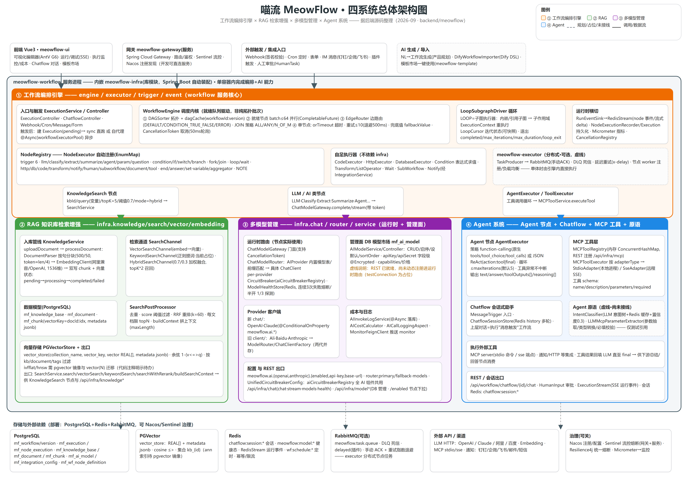
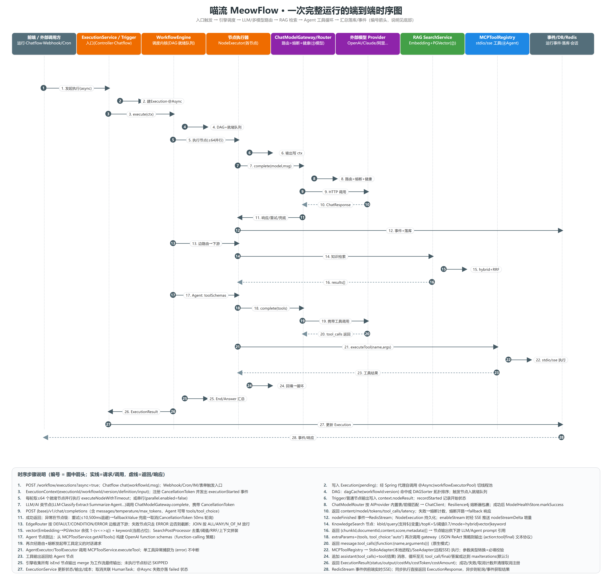
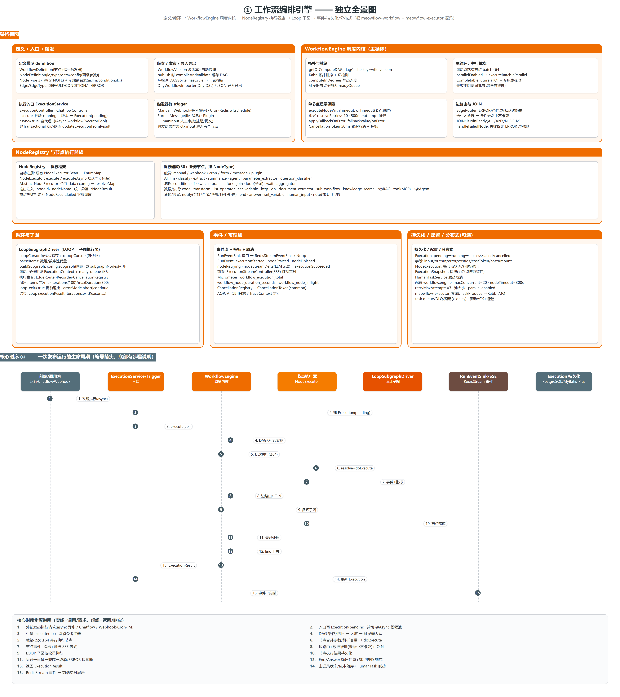
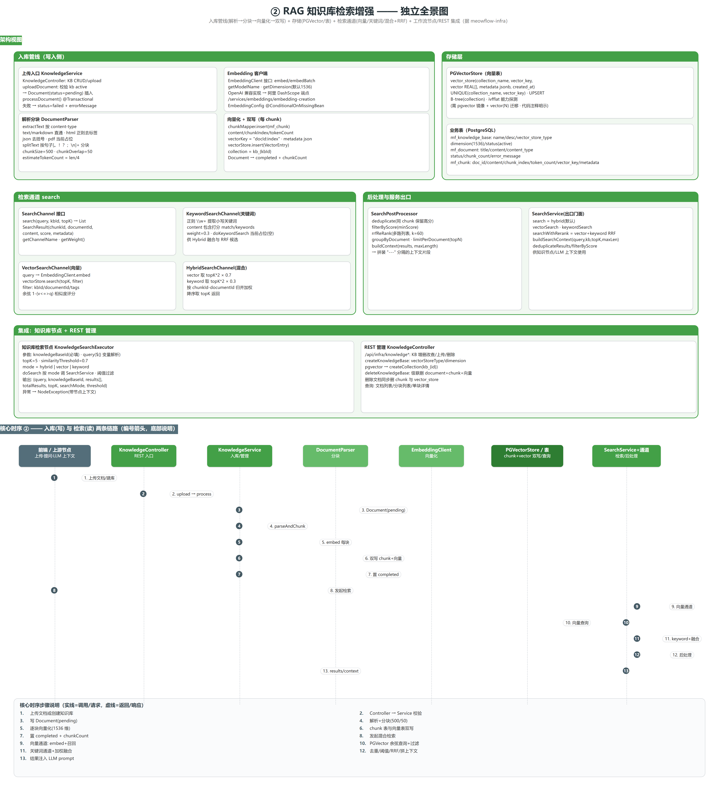
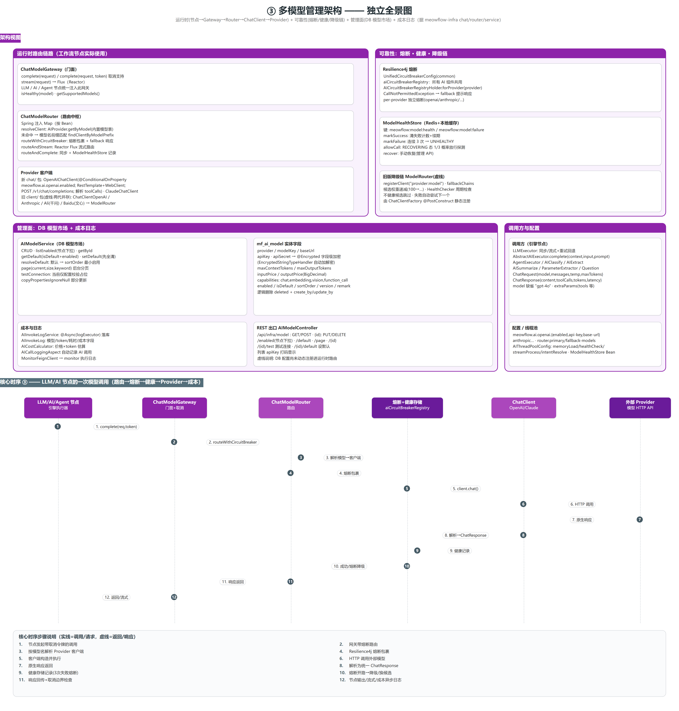
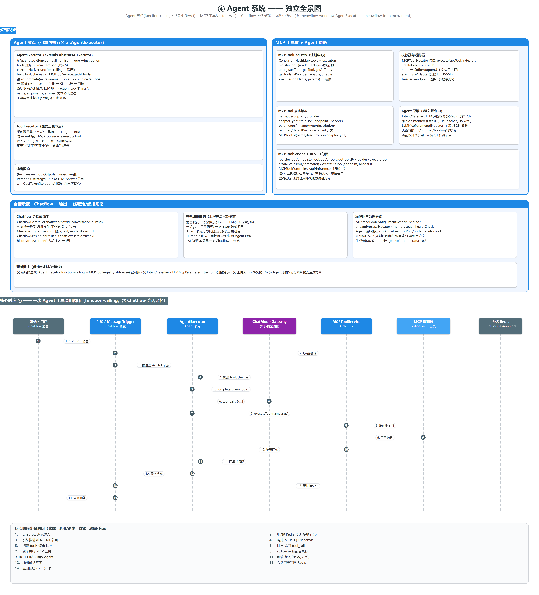

# 喵流 MeowFlow · 后端设计文档

> 版本：v1.0（2026-09） · 状态：评审中
> 关联源码：`backend/meowflow`（多模块 Maven）
> 关联文档：`architecture.md`、`database.md`、`docs/technical/modules/*`、`docs/technical/diagrams/*`

---

## 0. 阅读指引与图表目录

本文档把喵流后端拆成 **五大板块** 讲解：总体架构 → 端到端时序 → 四大核心子系统（工作流编排引擎 / RAG / 多模型管理 / Agent）→ 工程质量 → 数据与部署。文中的图均为可编辑源（HTML + 生成脚本），存放在 `docs/technical/diagrams/`。

| 编号 | 图 | 文件 | 用途 |
|---|---|---|---|
| 图1 | 四系统总体架构图 | `./diagrams/meowflow_arch.png` | 看整体：模块、四系统、依赖与存储 |
| 图2 | 端到端核心时序图 | `./diagrams/meowflow_seq.png` | 看一次运行从触发到落库的完整链路 |
| 图3 | ① 工作流编排引擎全景 | `./diagrams/fig_engine.png` | 引擎架构 + 调度时序 |
| 图4 | ② RAG 全景 | `./diagrams/fig_rag.png` | 入库/存储/检索/集成 + 时序 |
| 图5 | ③ 多模型管理全景 | `./diagrams/fig_model.png` | 路由/可靠性/管理面/成本 + 时序 |
| 图6 | ④ Agent 系统全景 | `./diagrams/fig_agent.png` | Agent 节点/MCP/会话 + 时序 |

图例约定：实线=调用/数据流；虚线=返回/响应 或 **规划/占位/未接线**（正文会显式说明）。

---

## 1. 概述

### 1.1 产品定位
喵流（MeowFlow）是一个**面向业务人员的可视化 AI 工作流平台**（类 Dify）：用户用拖拽画布把「LLM、知识库检索、Agent 工具、HTTP/DB、条件/循环、通知、人工审批」等节点拼成自动化流程，平台负责**可靠执行、实时监控与成本管理**。

### 1.2 设计目标与非目标
目标：
1. **可插拔**：新增节点/模型/工具/知识库时，业务代码不改，扩展点自动生效；
2. **正确**：条件分支未命中不阻塞、失败不误触发下游、并行收敛语义正确；
3. **可靠**：节点级超时/重试/兜底/取消，执行可中断、明细可追；
4. **可观察**：实时事件 + 明细落库 + 指标 + 告警；
5. **弹性**：单体先落地，支持把节点执行拆成 MQ 分布式 worker。

非目标（v1 不承诺）：跨进程断点恢复（已预留快照字段）、超大规模流式引擎、多租户强隔离。

### 1.3 技术栈
| 层 | 选型 |
|---|---|
| 语言/框架 | Java 17+/18 · Spring Boot 3 · Spring Cloud Alibaba |
| 服务治理 | Nacos（可关）· Spring Cloud Gateway · Sentinel（可关）· OpenFeign |
| 存储 | PostgreSQL（含 JSONB）· PGVector（向量）· Redis（会话/健康/事件/调度） |
| 消息 | RabbitMQ（可选分布式执行：手动 ACK/DLQ/延迟） |
| AI 客户端 | OpenAI/Anthropic 协议兼容封装 · 阿里 DashScope Embedding |
| 可观测 | Micrometer · Redis Stream（实时事件）· SSE · 结构化日志落库 |
| 构建/部署 | Maven 多模块 · Docker Compose |

---

## 2. 总体架构

### 2.1 模块划分：服务模块 vs 库模块
| 形态 | 模块 | 职责 |
|---|---|---|
| 服务 | meowflow-gateway | 统一入口：路由、鉴权(Sa-Token)、TraceId 透传、用户信息中继 |
| 服务 | meowflow-workflow | **核心业务服务**：定义/版本/引擎/触发器/Chatflow/执行入口 |
| 服务 | meowflow-user | 用户/组织/权限（Sa-Token） |
| 服务 | meowflow-template | 模板市场（分类/计数/一键使用） |
| 服务 | meowflow-monitor | 执行日志、指标、告警规则与多通道通知（钉钉/邮件/短信） |
| 服务(可选) | meowflow-executor | 分布式节点执行：RabbitMQ 任务分发/重试/死信 |
| 库 | meowflow-common | 基建：异常/返回、Redis、MQ、熔断、幂等、限流、加密、Trace、日志、线程池、Feign 客户端 |
| 库 | meowflow-infra | **AI 能力库**：LLM 路由/客户端、Embedding、RAG、MCP 工具、意图、集成通知、AI 模型配置 CRUD |
| 库 | meowflow-plugin-sdk | 插件开发 SDK |

> **关键决策**：`infra` 是**库模块**而非服务。AI 能力通过 Spring Boot 自动装配（`META-INF/spring/...AutoConfiguration.imports`）注入业务模块的 Spring 容器，节点执行在**进程内**直接调用 AI 能力门面，避免逐节点 RPC 的延迟与故障面；同名 Bean 用 `@ConditionalOnMissingBean` 保证“业务模块优先”，升级 infra 即可获得新能力。

### 2.2 总体架构图


读图要点：
- 顶部：前端（编辑器/监控/Chatflow）→ 网关 → 外部触发（Webhook/Cron/IM/表单）；
- 中框 = **workflow 服务进程**，左上是 ① 工作流编排引擎，右下并列 ② RAG / ③ 多模型 / ④ Agent（infra 库内）；
- 三条向下箭头是引擎节点 → infra 的能力桥接（LLM/AI→模型网关、知识检索→SearchService、Agent/Tool→MCP）；
- 底部：PostgreSQL / PGVector / Redis / RabbitMQ / 外部模型与通知渠道；虚线框 = 规划/占位/未接线项。

### 2.3 部署与运行形态
- 开发/演示：`docker-compose.dev.yml` 起 PostgreSQL、Redis、RabbitMQ（Nacos/Sentinel 默认关）；
- 生产：Gateway + 各服务 + Nacos 注册配置 + Sentinel，可选启用 executor 扩容节点执行；
- **单体内置执行**：workflow 引擎内直接跑节点（默认）；**分布式执行**：节点任务投递到 RabbitMQ，由 executor worker 执行并回传（手动 ACK + DLQ + 延迟重试）。

### 2.4 与前端的关键交互
- 运行/调试：`POST /api/workflow/executions`（同步或 `async=true`）；
- Chatflow：`/api/workflow/chatflow/{id}/chat`（会话记忆在 Redis）；
- 实时：执行事件经 Redis Stream → 前端 `SSE` 订阅（节点状态、LLM 流式增量）；
- 管理：工作流 CRUD/版本/导入导出、执行明细、成本统计接口。

---## 3. 端到端核心时序

一次典型运行覆盖：**触发 → 引擎调度 → LLM/多模型路由 → RAG 检索 → Agent 工具循环 → 汇总落库/事件推送**。



阶段说明（对应图 2 编号）：
1. 入口：`POST /executions?async=true` / Chatflow / Webhook·Cron·IM 触发；
2. `ExecutionService` 写 `Execution(pending)`，异步时经 **自代理 @Async(workflowExecutorPool)** 切线程池（规避 Spring 自调用失效）；
3. 引擎 `execute(ctx)`：注册 `CancellationToken`、发 `executionStarted`；
4. 拓扑：`dagCache(workflowId:version)` 命中或 Kahn 拓扑排序，触发器入就绪队列；
5. 就绪批次 ≤64 并行执行 `executeNodeWithTimeout`；
6. 节点执行器合并 `data/config` 参数并解析 `${}` 变量 → `doExecute`；
7. 节点事件（started/finished）+ 指标 + 可选 SSE 流式增量；
8. `EdgeRouter` 选下游 → 动态到达计数推进；JOIN 按 ALL/ANY/N_OF_M 放行；
9. LOOP：`LoopSubgraphDriver` 子作用域逐轮重执行（游标/退出条件/errorMode）；
10. 节点结果写 `NodeExecution` 落库；
11. 失败处理：重试(≤10, 退避)→兜底值→取消；失败仅沿 ERROR 边；
12. End/Answer 汇总 merge 输出，未执行节点标 SKIPPED；
13. 返回 `ExecutionResult(status/output/costMs/costToken/costAmount)`；
14. 主记录更新 + HumanTask 联动取消；
15. Redis Stream 事件 → 前端实时（SSE），异步方轮询 Execution。

---

## 4. ① 工作流编排引擎设计

### 4.1 设计目标
把「画布上的 DAG」变成「可靠、正确、可观察、可插拔」的执行：新增节点只写一个执行器 Bean；条件/分支语义在**图层面**保证；单点故障不影响整体调度。

### 4.2 领域模型
- `WorkflowDefinition`：`nodes[] + edges[] + triggerNodes[]`；
- `NodeDefinition`：`id/type/name/data`；参数兼容两种形态（编辑器在 `data.config`、模板/旧 DSL 平铺在 `data`），执行时合并；
- `Edge`：`source→target + EdgeType(DEFAULT/CONDITION/CONDITION_TRUE/FALSE/ERROR)`；
- `NodeType`：平台内置 30+ 种节点类型（按 6 大类划分，含 NOTE 等辅助类型）+ 前端别名表归一（`ai.llm`→`LLM`、`condition.if`→`CONDITION`…），未知类型由发布校验报可读错误；
- 运行期：`ExecutionContext`（含 variables/nodeResults/loopCursors/取消令牌）、`NodeResult`（PENDING→RUNNING→SUCCESS/SKIPPED/FAILED/CANCELLED/TIMED_OUT）、`ExecutionResult`。

### 4.3 编译期（发布即缓存执行计划）
1. 发布调用 `WorkflowEngine.compileAndValidate`：节点非空、有触发节点、`DAGSorter.hasCycle` 无环；
2. 通过后将拓扑结果（排序 + 出边表）写入 `dagCache`，**key=workflowId:version**；
3. 运行期 `getOrComputeDAG` 命中缓存 → 同一版本零重复拓扑计算。

### 4.4 运行期调度算法（核心）
核心思想：**就绪队列 + 动态到达计数**，而非静态按层跑。

```
readyQueue ← 全部 trigger 节点
while readyQueue 非空:
    batch ← 取出 ≤64 个就绪节点
    并行/串行执行 batch（每节点：超时/重试/兜底/取消）
    对每个完成节点 result:
        targets ← EdgeRouter.selectDownstreamEdges(node, edges, result)
        advanceDownstream(node, targets)
    失败节点 → handleFailedNode()（只走 ERROR 边，否则截断）
汇总 isEnd 节点输出 → merge 为工作流输出；未执行节点 → SKIPPED
```

为什么这样设计（关键取舍）：
- 每条出边都会让目标 `requiredArrivals` **减 1**（无论是否被选中）→ **被跳过的分支不会让下游永远等入度（不卡死）**；
- 只有**被边路由选中的边**才增加 `arrivedCounts` → **没走到的分支不会被误执行**；
- 并行批次上限 64 + 专用线程池 → 控制并发面；同一批内单节点失败不阻塞其他节点；
- 每节点带独立超时/重试/兜底 → 调度不被慢节点拖死。

### 4.5 边路由与 JOIN
- `EdgeRouter.selectDownstreamEdges` 优先级：ERROR 边（失败/取消时）→ 显式条件边（TRUE/FALSE/表达式求值）→ 回退放行全部非 ERROR 边；
- JOIN `isJoinReady`：`ALL`（入度到齐）/ `ANY`（≥1）/ `N_OF_M`（≥requiredCount）；`joinArrived/joinReleased` 防重复放行。

### 4.6 循环 = 子图执行器
`LoopSubgraphDriver` 把 LOOP 从计数器升级为**真子图执行**：每轮读取 `LoopCursor` 迭代状态 → 构造子作用域 `ExecutionContext` → 复用就绪队列机制跑完子图 → 收集输出推进游标。退出条件：items 耗尽 / maxIterations(100) / maxDurationSeconds(300) / 取消 / `loop_exit=true`；`errorMode=abort|continue`。游标存于 `context.loopCursors`，可随快照序列化（为断点恢复预留）。

### 4.7 节点框架与执行器族
- `NodeRegistry`：收集容器内所有 `NodeExecutor` Bean，按 `getNodeType()` 写入 `EnumMap` → **新增节点=新增一个 Spring Bean，零配置**；
- `AbstractNodeExecutor.execute`：合并参数 → `resolveMap` 解析变量 → `doExecute` → 输出注入 `_nodeId/_nodeName` → 异常归一为 `NodeResult.failed`（不打断调度）；
- 执行器族（30+ 种业务节点，按 6 大类）：触发 6、AI 7、流程控制、数据/集成、通知/收尾（详见图 3）。

### 4.8 节点级质量保障
| 能力 | 机制 |
|---|---|
| 超时 | `CompletableFuture.orTimeout(节点超时)` → TIMED_OUT |
| 重试 | 读 `retries/retryOnFail`（≤10），退避 500ms×(attempt+1)，发 `nodeRetrying` |
| 兜底 | 失败读 `fallbackValue`/`onError.defaultValue` → 成功输出带 `_originalError` |
| 取消 | `CancellationToken`，Future 50ms 轮询；LLM 等在调用边界检查令牌 |
| 指标/事件 | in-flight Gauge + 耗时 Timer + nodeStarted/Finished 事件 |

### 4.9 执行生命周期 / 持久化 / 事件
- `Execution`：pending→running→success/failed/cancelled；带 input/output/costMs/costToken/costAmount；
- `NodeExecution`：每节点状态/耗时/token/输出（执行明细页与统计的数据源）；
- 事件 `RunEvent`（started/finished/retrying/streamDelta/…）→ `RedisStreamEventSink` → 前端 SSE；
- 指标：`workflow_execution_total`、`workflow_node_duration_seconds`、`workflow_node_inflight`（Micrometer）。

### 4.10 分布式执行（可选）
`meowflow-executor`：`TaskProducer` 投递节点任务（支持优先级/延迟 x-delay），`TaskConsumer` 手动 ACK，超限进 DLQ，指数退避重试——为“引擎调度 → MQ worker 执行 → 回调”预留开关；默认单体在 workflow 内直接执行。

### 4.11 系统全景与关键类


| 关注点 | 关键类 | 路径(简) |
|---|---|---|
| 调度内核 | `WorkflowEngine` | workflow/.../engine/WorkflowEngine.java |
| 拓扑/批次 | `DAGSorter` | engine/DAGSorter.java |
| 边路由/JOIN | `EdgeRouter` | engine/EdgeRouter.java |
| 节点注册/骨架 | `NodeRegistry` / `AbstractNodeExecutor` | executor/ |
| 循环子图 | `LoopSubgraphDriver` | executor/condition/ |
| 编排入口 | `ExecutionService` | service/ExecutionService.java |
| 事件 | `RunEventSink`/`RedisStreamEventSink` | event/ |
| 分布式 | `TaskProducer`/`TaskConsumer` | meowflow-executor/mq/ |

---## 5. ② RAG 知识库检索增强设计

### 5.1 目标
让 LLM 能基于**私有知识**回答：提供"上传文档 → 自动分块向量化 → 多路检索 → 拼上下文"的完整能力，并把检索封装成工作流节点。

### 5.2 入库管线（写侧）
`KnowledgeService.uploadDocument` → `processDocument`（事务）：
1. 校验知识库 active，插入 `Document(pending)`；
2. `DocumentParser`：按 content-type 提取文本（text/markdown 直通、html 正则、json/pdf 简化）→ 按句子分块（chunkSize=500、overlap=50，token≈len/4）；
3. 逐块 `EmbeddingClient.embed`（默认 1536 维，OpenAI/阿里兼容端点）；
4. **双写**：`mf_chunk`（内容/序号/token 数/vectorKey=docId:index/metadata JSON）+ `vector_store`（PGVector，collection=`kb_{id}`）；
5. 更新 `Document(completed, chunkCount)`；失败置 failed 并回滚。

### 5.3 存储设计
- `vector_store(collection_name, vector_key, vector REAL[], metadata jsonb, created_at, UNIQUE(collection,key))`，UPSERT；
- 查询用余弦相似度 `1 - (vector <=> ?)`，支持按 metadata(kb/document/tags) 过滤 + 距离排序 + LIMIT；
- ANN 索引（ivfflat/hnsw）依赖 pgvector 原生 `vector(N)` 类型，当前 `REAL[]` 为能力探测 + 待迁移项（代码注释明示）。

### 5.4 检索与后处理（读侧）
- 通道抽象 `SearchChannel.search(query,kbId,topK) → SearchResult(chunkId,documentId,content,score,metadata)`：
  - `VectorSearchChannel`：embed 查询 → 向量召回（主路径）；
  - `KeywordSearchChannel`：正则提词打分（weight 0.3，**当前为占位实现**，规划接 DB 全文/ES）；
  - `HybridSearchChannel`：vector topK*2(0.7) + keyword topK*2(0.3) 加权归并排序取 topK；
- `SearchPostProcessor`：去重、score 阈值、RRF 多路融合(k=60)、按文档限块、`buildContext` 拼装上下文；
- 出口 `SearchService`：`search/vectorSearch/keywordSearch/searchWithRerank/buildSearchContext`。

### 5.5 与工作流集成
`KnowledgeSearchExecutor`（知识检索节点）：参数 `knowledgeBaseId`(必填)/`query`(支持 `${}` 变量)/`topK=5`/`similarityThreshold=0.7`/`mode=hybrid|vector|keyword`，按阈值过滤后输出 `{results[], totalResults, ...}` 供下游 LLM/Agent 引用；另提供 `/api/infra/knowledge*` 管理 REST（建库/上传/级联删除/查询）。

### 5.6 系统全景与演进


现状与演进：
- 已落地：分块+向量化+双写、向量/混合检索、阈值+RRF、知识节点化；
- 演进：关键词通道落库、PDF/HTML 专业解析、pgvector 原生类型与 ANN 索引、Embedding 成本/批量化、重排模型。

---

## 6. ③ 多模型管理架构设计

### 6.1 分层
```
引擎 AI 节点（LLM/AI/Agent…）
      │ ChatModelGateway（门面：同步/流式 + 取消令牌）
      ▼
ChatModelRouter（按模型名路由：AIProvider 内置表 → 前缀匹配）
      ▼
chat.ChatClient（OpenAI / Claude @ConditionalOnProperty）
```
统一请求/响应模型 `ChatRequest/ChatResponse`（含 toolCalls/tokens/latency），做到**换模型不改业务代码**。

### 6.2 可靠性
- **熔断**：`aiCircuitBreakerRegistry`（common 统一配置）按 Provider 独立 Resilience4j 熔断，`CallNotPermitted → fallback 响应`；
- **健康存储** `ModelHealthStore`：Redis + 本地缓存，连续 3 次失败→UNHEALTHY；RECOVERING 半开 1/3 概率放行探测；支持手动恢复；
- **降级链**：旧版 `ModelRouter` 候选链（权重递减 + 健康跳过 + 失败自动切换）保留兼容。

### 6.3 管理面：DB 模型市场
`mf_ai_model`（`AIModelService/AIModelController`）：
- 字段：provider/modelKey/baseUrl、**apiKey/apiSecret 字段级 AES 加密**（`@Encrypted`+TypeHandler）、上下文/输出上限、input/output 价格、capabilities、enabled/isDefault/sortOrder/version/remark、逻辑删除；
- 能力：CRUD/启停/设默认/排序/分页/测试连接；
- **现状说明**：管理 API 已就绪，动态注册进运行时路由为**规划项**（当前运行时走配置化客户端）。

### 6.4 成本计量
- `AICallLoggingAspect` 拦截模型调用：自动记录 model/provider/prompt/各 tokens/耗时/状态（成功=1/失败=0），`AIInvokeLogService.logInvoke` **@Async 异步落库**（`mf_ai_invoke_log`）；
- `AICostCalculator` 按内置单价表（USD/1M tokens）换算 `costAmount`；
- 聚合：`getCostStatistics` + `selectCostByModel`（按模型/用户/时间聚合）；
- **边界说明**：切面当前覆盖对话主调用路径；Embedding 与新版网关全量接入、以及单价的 DB 动态定价为演进方向。

### 6.5 系统全景


---

## 7. ④ Agent 系统设计

### 7.1 Agent 作为一等节点
`AgentExecutor`（extends `AbstractAIExecutor`），两种策略：
- **function-calling（原生主路径）**：把 `MCPToolService.getAllTools()` 转成 OpenAI function schemas → 循环 `complete(extraParams={tools, tool_choice:"auto"})` → 解析 `tool_calls` → 逐个执行工具 → 回填 `assistant(tool_calls)+tool` 消息 → 直至无 tool_call 收敛；
- **JSON ReAct（备选）**：LLM 输出 `{action:"tool"|"final", name, arguments, answer}` 文本协议驱动同一循环；
- 防护：`maxIterations`(默认5) 上限；单工具异常捕获为 `{error}` 不中断整轮；输出 `{text/answer/toolOutputs[]/reasoning[]}`。
- `ToolExecutor`：手动"指定工具"节点，复用 MCP 执行。

### 7.2 MCP 工具框架
`MCPToolRegistry`（内存注册中心）+ `MCPToolExecutor` 按 `adapterType` 创建：
- `stdio → StdioAdapter`（本地命令子进程）；
- `sse → SseAdapter`（远程 HTTP/SSE）；
- 工具描述 `MCPTool`：name/description/provider/endpoint/headers/parameters[](type/required/default)；
- REST：`/api/infra/mcp` 注册/注销（当前**无 DB 持久化**，重启丢失，为演进项）。

### 7.3 Chatflow：会话式助手
- `ChatflowController.chat` = 执行一条"消息触发"的工作流；
- `MessageTriggerExecutor` 提取 text/sender/keyword；
- `ChatflowSessionStore`：Redis `chatflow:session:{conversationId}` 存 history，多轮注入上下文。

### 7.4 规划中原语（明确未接线）
`IntentClassifier`（LLM 意图树 + Redis 缓存 + 置信度）与 `LLMMcpParameterExtractor`（参数抽取/类型转换/必填校验）为已实现的独立组件，当前仅测试引用；多 Agent 编排、向量化长期记忆、工具仓库持久化为演进方向。

### 7.5 系统全景


---## 8. 后端工程质量

### 8.1 可靠性能力清单
| 能力 | 实现 | 位置(简) |
|---|---|---|
| 接口幂等 | `@Idempotent` + AOP + Redis 存储 | meowflow-common/idempotent |
| 限流/熔断 | Sentinel（可关）+ Resilience4j 统一熔断；`aiCircuitBreakerRegistry` | common/rate、common/config |
| 异步可靠性 | 场景化线程池；`@Async` 异常处理器；TTL 上下文透传 | common/config |
| 消息可靠 | RabbitMQ 手动 ACK + DLQ + 延迟重试(x-delay) | meowflow-executor/mq |
| 触发安全 | Webhook 签名校验（HMAC） | common/webhook |
| 敏感存储 | 字段级 AES 加密 `@Encrypted` | common/security + mybatis |
| 数据一致性 | 关键写路径事务 + 双写 + 级联清理 | 各 repository |

### 8.2 可观测
- **链路**：网关 `TraceIdFilter`（X-Trace-Id 生成/透传）→ 服务内 `ContextFilter` 建 TraceContext → 线程池 `TtlExecutors` 透传 → `@TraceNode` 切面输出 span（traceId/spanId/parentSpan/duration）；
- **日志**：Logback JSON/MDC；`PostgresAppender` **异步批量落库**（含 traceId，队列满降级文件），开关 `meowflow.log.async-enabled`；
- **指标**：引擎 `workflow_*` 打点（Micrometer）；monitor 提供指标记录/查询 API + JVM 指标；
- **告警**：`AlertService` 规则（metric/operator/threshold/duration/channels + 静默）→ `Dingtalk/Email/SmsNotifier` 多通道通知；
- **成本**：AI 调用 AOP 日志 + 异步落库 + 单价换算 + 按模型/用户聚合（边界见 §6.4）。

### 8.3 安全
Sa-Token 认证授权（user/gateway）、网关用户信息中继（X-User-*）、字段级加密、Webhook 签名校验、敏感字段打码返回。

### 8.4 测试
- 单测（引擎/执行器/服务/触发器等）+ 契约测试（Feign 契约）+ 集成/E2E（`meowflow-e2e`，DB/Redis/MQ 全链路，monitor 以 MockBean 隔离）；
- 测试文档见 `docs/technical/test/`。

### 8.5 已知局限与诚实标注
| 项 | 状态 |
|---|---|
| KeywordSearchChannel | 占位（通道与打分已实现，未接 DB 召回） |
| DB 模型市场 → 运行时路由 | 管理面已就绪，动态注册未接线 |
| 成本 AOP 覆盖范围 | 对话主路径已覆盖；Embedding/新网关全量接入规划中 |
| 模型单价 | 内置表；DB 动态定价为预留 |
| 模型级成本 REST | 服务层聚合已具备，接口/页面规划中 |
| 引擎指标→monitor | 单体为本地 Micrometer；分布式 executor 路径已上报 |
| IntentClassifier / 参数抽取 | 组件已实现、未接入工作流节点 |
| ExecutionSnapshot 恢复 | 快照字段预留，恢复执行规划中 |
| 工具持久化 | MCP 工具内存注册，无 DB |

> 设计原则：**已接线的写成"已交付"；未接线的写成"已实现组件/设计预留"**，保证文档与代码口径一致，也便于后续演进。

---

## 9. 数据模型概览（核心表）
| 域 | 表 | 说明 |
|---|---|---|
| 工作流 | mf_workflow / mf_workflow_version | 定义 + 多版本（发布/回滚/导入导出） |
| 执行 | mf_execution / mf_node_execution / mf_execution_snapshot | 执行主记录、节点明细、快照（预留恢复） |
| 触发 | mf_schedule(按实现) | Cron 等（Redis wf:schedule:*） |
| 知识 | mf_knowledge_base / mf_document / mf_chunk | RAG 三级模型 |
| 向量 | vector_store | collection/key/REAL[]/jsonb |
| AI 配置 | mf_ai_model / mf_integration_config | 模型市场（加密字段）、通知集成配置 |
| AI 日志 | mf_ai_invoke_log | 调用/成本明细 |
| 节点定义 | mf_wf_node_definition | 内置/自定义节点 schema（扩展点） |
| 监控 | monitor：alert_rule / alert_record / alert_silence / execution_log / metric_* | 告警与指标 |
| 用户/模板 | mf_user 体系、template_* | 用户组织、模板市场 |
> 详见 `docs/technical/database.md` 与 `scripts/sql/`。

---

## 10. 部署与配置要点
- 依赖：PostgreSQL(≥13, 建议 pgvector 镜像)、Redis(≥6)、RabbitMQ(≥3.8, 延迟插件可选)、JDK17+、Node18+；
- 服务：gateway / user / workflow / template / monitor [ / executor ]，Nacos/Sentinel 可关（dev 直连）；
- 关键配置：`meowflow.ai.*`、`workflow.engine.*`、`meowflow.log.async-enabled`、`embedding.*`、`monitor.*` 通知地址；
- 一键启动：`backend/meowflow/deploy/docker/docker-compose.dev.yml / prod.yml`。

---

## 11. 关键技术决策与权衡（汇总）
1. **就绪队列 + 动态到达计数**（而非静态分层批次）：正确表达"条件未命中不卡死、未走分支不误执行"；
2. **编译期 DAG 缓存、版本即不可变执行计划**：发布期拦截错误，运行期零重复计算；
3. **LOOP 子图化**：循环体可继续可视化编排任意节点，与主机制复用同一套调度/事件/持久化；
4. **infra 库模块 + 进程内调用 AI 门面**：低延迟、少故障面、可插拔、可统一升级；
5. **两代模型客户端并存**：新 `chat/` 反应式网关供节点使用，旧 `client/` 兼容保留——收敛为新统一网关是演进重点；
6. **事件(Redis Stream)与 DB 明细双写、不强一致**：实时性给前端，完整性给审计，事件失败只告警不阻断执行；
7. **单体优先、MQ 分布式可选**：先保证正确与可观察，再谈水平扩展。

---

## 12. 演进路线图
| 方向 | 下一步 |
|---|---|
| 引擎 | 工作流级 onError 策略矩阵、断点恢复落地、触发幂等 |
| RAG | keyword 落库、专业解析、pgvector 原生类型/ANN、Embedding 批量化 |
| 多模型 | DB 模型市场动态注册、统一网关收敛两代客户端、单价 DB 化 |
| Agent | 意图路由接线、工具持久化、多 Agent 编排、向量记忆 |
| 平台 | 资源配额、租户隔离、成本看板、插件市场 |

---

## 附录 A：后端目录速览
```
backend/meowflow/
├─ meowflow-gateway/     网关（路由/鉴权/Trace/用户中继）
├─ meowflow-workflow/    核心：definition/compiler/engine/executor/trigger/event/service
├─ meowflow-user/        用户与权限
├─ meowflow-template/    模板市场
├─ meowflow-monitor/     执行日志/指标/告警
├─ meowflow-executor/    分布式节点执行（MQ）
├─ meowflow-infra/       AI 能力库：chat/router/knowledge/search/vector/embedding/mcp/intent/integration
├─ meowflow-common/      基建库：trace/log/security/idempotent/rate/mq/redis/webhook…
├─ meowflow-plugin-sdk/  插件 SDK
├─ meowflow-e2e/         端到端测试
└─ deploy/  scripts/     Docker、Nacos、SQL
```

## 附录 B：图表源文件
| 图 | PNG | 可编辑源 |
|---|---|---|
| 图1 | `diagrams/meowflow_arch.png` | `diagrams/meowflow_arch.html` |
| 图2 | `diagrams/meowflow_seq.png` | `diagrams/meowflow_seq.html` |
| 图3-6 | `diagrams/fig_{engine,rag,model,agent}.png` | `diagrams/fig_{engine,rag,model,agent}.html` |

> 图片均由 HTML/CSS+SVG 生成并经无头浏览器渲染；修改 HTML 后可重新截图更新 PNG。

---

*本文档与代码保持同步口径：图中虚线与 §8.5 明确标注了"占位/规划/未接线"项。*